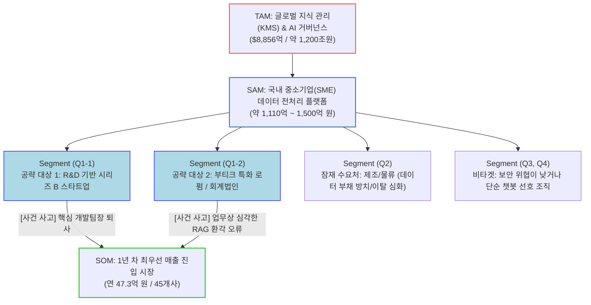
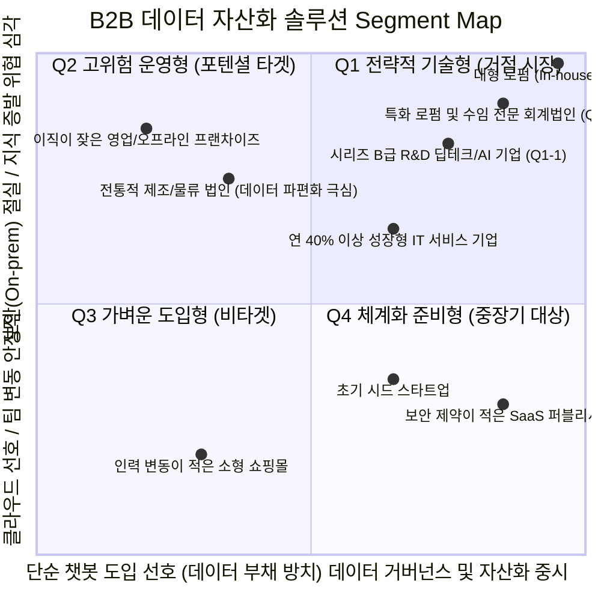

# 최종: 시장 전략 시각화 리포트

본 리포트는 "중소기업(SME)용 실시간 데이터 클리닝 OS(데이터 자산화 솔루션)" 비즈니스 모델의 종합적인 시장성 검증 결과를 시각화한 결과물입니다.

---

## 1. TAM-SAM-SOM 시장 구조 분기 (Flowchart)

우리의 솔루션은 전 세계적인 지식 관리(KMS) 수요에서 출발하여, 한국 시장 내 보안 및 유실 위협에 놓인 기업들을 타겟팅한 후, 최종적으로 '핵심 인력 퇴사' 및 '환각 리스크 방어'라는 명확한 트리거가 있는 고부가가치 타겟(스타트업, 전문직 법인)으로 집중되는 구조(Funnel)를 가집니다.

---

## 2. 시장 규모 및 근거 요약 테이블

각 시장 계층의 규모와 논리적 근거는 다음과 같습니다.

| 구분 | 시장 정의 (Market Definition) | 시장 규모 데이터 추정 | 핵심 논리 근거 |
| :--- | :--- | :--- | :--- |
| **TAM** (전체 시장) | 전 세계 KMS 시스템 및 RAG 인프라를 위한 기업용 데이터 준비(Data Preparation) SW 총 시장 | 연간 약 **$8,856억** (약 1,200조 원) | 글로벌 지식관리 시장 통계(2024년 기준 8,856억 달러) 및 AI 기반 전처리 필수재화 트렌드 반영. |
| **SAM** (유효 시장) | 한국 내 인사/총무 부서 주도의 '비정형 데이터 전처리/클리닝 OS' 및 정부 예산 매칭형 '프라이빗 RAG' 도입 시장 | 연간 약 **1,000억 ~ 1,500억 원** | 글로벌 비중 5% 추산, 2025년 정부 AI/혁신 바우처 총합 약 714억 원 기반 중소기업 실수요 구매력 추정 논리. |
| **SOM** (수익 시장) | 잦은 퇴사로 인한 지식 유실과 시스템 오답률(환각)에 가장 예민한 타겟 기업 (스타트업 30곳 + 전문직 법인 15곳 우선 획득) | 달성 목표 연 **47.3억 원** | 핵심 세그먼트 공략 포트폴리오를 통해 각각 달성 가능 규모 도출. |

---

## 3. Market Segment Map (2x2 Matrix)

'어느 사분면(Quadrant)의 고객부터 찾아갈 것인가?'에 대한 해답입니다. 데이터 자산화에 대한 열망이 강하면서도(X축 우측), 보안 제약 및 지식 유출 비용 리스크가 심각한 그룹(Y축 상단)이 위치한 **Q1(1사분면)**이 우리의 전략적 거점입니다.

### [세그먼트 맵 분석 시사점]
* **핵심(Q1, 우상단)**: 당사 솔루션의 고비용/고품질 가치(환각 제거율 54%->8%, 망분리 등)에 가장 큰 지불 용의(Willingness to Pay)를 가진 핵심 그룹입니다. 이들을 대상으로 '퇴사 시점'에 맞춘 타깃팅(PoC)이 효과를 발휘합니다.
* **잠재(Q2, 좌상단)**: 본인들의 데이터 부채가 얼마나 심각한지 정량적으로 깨닫지 못한 상태로, 향후 데이터 붕괴 사건이 일어날 때 Q1으로 이동하며 폭발적인 가망 고객이 될 가능성이 큽니다.
