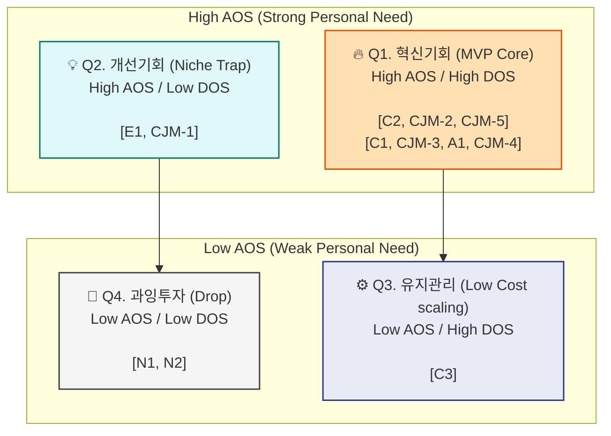

# AOS-DOS 결합 시장 진입 및 MVP 우선순위 평가

본 문서는 고객의 미충족 페인(AOS)에 이어, TAM-SAM-SOM 시장 조사 데이터에 기반한 **Market Relevance(시장 연관도)**를 결합하여 최종적인 **방향성 수익화 지수(DOS, Demand Opportunity Score)**를 도출한 보고서입니다. 

이를 통해 "고객만 아프고 시장은 작은(돈이 안 되는)" 맹점(Trap)을 걸러내고, 가장 빠르고 확실한 MVP 스펙을 확정합니다.

---

## A. Market Relevance(MR) 및 DOS 산출 기준

*   **Market Relevance (MR, 0.1~1.0)**: 해당 Pain이 우리의 타겟 시장(TAM-SAM-SOM)에서 갖는 비중, 채택 및 확산 난이도, 실제 영업 접근성을 평가한 '시장 파급력/수익화 가능성' 계수.
*   **Demand Opportunity Score (DOS)**: `AOS × MR`
    *   개인/소수 집단의 강렬한 수치인 AOS를 '실제 시장에서 돈이 될 규모와 속도'로 치환한 실질적 비즈니스 기회 점수.

---

## B. DOS 계산 — 전체 항목

| # | Pain / Goal | Imp | Sat | MR | MR 근거 (TAM-SAM-SOM 연계) | DOS |
| :---: | :--- | :---: | :---: | :---: | :--- | :---: |
| **C2** | 법률/특수 표 양식 파싱 실패 (리걸리스크) | 5 | 1 | **0.9** | 법률·회계 등 고부가가치 전문직(SOM)의 가장 절대적인 요구사항이며 즉각적 지불 용의(WTP) 최상 | **3.60** |
| **CJM-2**| 텍스트 외 가장 중요한 물리적 서식 깨짐 | 5 | 1 | **0.9** | 모든 B2B 데이터 솔루션 도입 단계에서 거치는 산업 초월적 공통 병목 (초기 확산성 필수) | **3.60** |
| **CJM-5**| AI 오류 색출 보조 UX 부재 (불신/검수) | 5 | 1 | **0.8** | 엔터프라이즈 전환율을 극대화하는 UX적 차별점이나, 핵심 알고리즘보단 한 단계 후순위 | **3.20** |
| **C1** | R&D 레거시 데이터 파편화 및 연동 단절 | 5 | 2 | **0.9** | 당사의 최우선 SOM(시리즈A~B Tech)의 생태계를 지배하는 최핵심 사안 | **2.70** |
| **CJM-3**| 클라우드 사용에 따른 정보 유출 보안 공포 | 5 | 2 | **0.9** | 전 산업(TAM)의 B2B 소프트웨어 채택 시 가장 강력한 법적/심리적 기저 허들 | **2.70** |
| **A1** | 수많은 영수증 포맷 양식 붕괴 및 야근 | 5 | 2 | **0.8** | 반복되는 확고한 시즌 시장이며 회계를 넘어 일반 기업 재무팀으로 스케일업(SAM) 용이 | **2.40** |
| **CJM-4**| 데이터 일일이 옮기는 मा이그레이션 노가다 | 4 | 2 | **0.8** | 온보딩 포기의 70%가 일어나는 마찰 구간으로, 해결 시 채택난이도를 급격히 낮춤 | **1.92** |
| **CJM-1**| 데이터 자산 누수를 항상 뒤늦게 사후 체감 | 4 | 2 | **0.6** | 근본적인 B2B 결제 트리거라기보단, 마케팅(광고/대시보드) 용도의 훅(Hook) 역할 | **1.44** |
| **E1** | 구형 시스템의 키보드/IT 조작 불가 장벽 | 4 | 1 | **0.3** | 제조업(TAM) 파이는 거대하나 초고령화/IT기피 등으로 실제 디지털 확산(채택) 속도는 최악의 구간 | **0.96** |
| **C3** | 사내 규정 핑퐁 및 사내 위키 통제 부재 | 4 | 3 | **0.5** | 범용 오피스(SAM) 시장 전체의 문제나, 대충 때우며 버티기 가능해 최우선 예산 배정 안 됨 | **0.80** |
| **N2** | B2C 긴 텍스트의 구조 무관 가벼운 요약 | 2 | 4 | **0.1** | 당사의 타겟이 아닌 B2C 범용 소비자 시장 / 이미 챗GPT가 100% 시장 장악 | **0.04** |
| **N1** | 망분리 상황 하 자체 데이터 인프라 강박 | 5 | 4 | **0.0** | 영업 자체가 구조적으로 차단된 대기업 인바운드 시장(안티 타겟). MR 0 수렴. | **0.00** |

---

## C. DOS 내림차순 종합 순위 (최고 수익성 타겟형)

단순한 Needs(AOS)가 아닌 Needs × Market(DOS)를 곱한 시장 강도 랭킹입니다.

| 순위 | Pain ID | Pain 내용 | 분류 | AOS | DOS | Insight (시장 파괴력 통찰) |
| :---: | :---: | :--- | :---: | :---: | :---: | :--- |
| **1위** | **C2** | 특수 양식(표) 파싱 붕괴 | 로펌 | 4.0 | **3.60** | 고객의 결핍도 최고조, 시장 지불 용의도 최고 수준인 완벽한 스윗스팟 |
| **1위** | **CJM-2**| 폼 붕괴 (문서 파편화) | 여정 | 4.0 | **3.60** | 어떤 산업에서든 B2B 도입의 첫 허들. 이것의 극복이 기술 해자 그 자체 |
| **3위** | **CJM-5**| 검수 UX (Human-loop)| 여정 | 4.0 | **3.20** | 결과물에 책임을 져야 하는 전문직/기업의 채택률(MR)을 급상승시킴 |
| **4위** | **C1** | R&D 레거시 데이터 단절 | CTO | 3.0 | **2.70** | 타겟(SOM) 확산성이 극심하여, AOS는 3.0이나 DOS(매출 전환)는 최상위 |
| **4위** | **CJM-3**| 기업 클라우드 보안 공포 | 여정 | 3.0 | **2.70** | 예산 승인권자(경영진)를 뚫기 위한 전제 조건(MR 0.9 견인) |
| **6위** | **A1** | 다중 포맷 영수증 엑셀화 | 회계 | 3.0 | **2.40** | 회계/세무라는 명확한 돈줄(SAM)과 닿아있어 무시할 수 없는 캐시카우 |
| **7위** | **CJM-4**| 마이그레이션 중노동 | 여정 | 2.4 | **1.92** | Onboarding(채택 채널 확산)을 뚫어내는 1-Click 연동의 시장 기여도 증명 |
| **8위** | **CJM-1**| 데이터 누수 체감 부재 | 여정 | 2.4 | **1.44** | 영업용 진단 툴 정도의 가치. 유료 결제를 강제할 메인 동력은 아님 |
| **9위** | **E1** | 구세대 타자/IT 인식 장벽 | 공장 | 3.2 | **0.96** | *(역전)* 고객 고통(AOS 3.2)은 극심하나, 시장 채택률(MR 0.3)의 비참함으로 수익 타당성 붕괴 |
| **10위** | **C3** | 사내 규정 핑퐁 | 인사 | 1.6 | **0.80** | 지불 용의가 낮아 타 부서(C1) 도입 후 무료 연장에 기대야 함 |
| **11위** | **N2** | B2C 단순 요약 니즈 | B2C | 0.4 | **0.04** | 접근 원천 배제 (시장 매력 0) |
| **12위** | **N1** | 대규모 통합 인프라 구축 | 은행 | 1.0 | **0.00** | 접근 원천 배제 (영업 접근성 0) |

---

## D. AOS-DOS 결합 매트릭스

고객이 원해도 우리가 팔 수 없다면 그건 함정입니다. **Y축: 고객의 고통 (AOS)**과 **X축: 시장의 돈벌이(DOS)**를 믹스한 Matrix 시각화입니다.
(기준선: AOS 평균 2.5 / DOS 평균 1.5)

---

## E. AOS vs. DOS 비교 — 핵심 발견 내용과 설명

**1. "함정(Trap)의 발견" : 오석동 공장장(E1)의 몰락**
*   **패턴**: `High AOS (3.2)` → `Low DOS (0.96)` 통계적 추락
*   **설명**: 공장장님은 디지털 문맹으로 인해 엄청난 고통(AOS 최상위권)을 겪고 있습니다. 하지만 이들을 위한 철저한 멀티모달(Zero-config) 생태계를 만들더라도, **해당 제조업 기반 TAM-SAM 내 결정권자들의 신기술 채택 속도와 전파력(MR)**이 워낙 둔감하여 투자 대비 매출(DOS)이 회수되지 않습니다. 이들의 Pain은 숭고하나, 초기 스타트업의 런웨이를 태울 MVP 타겟에서는 제외(Q2 Niche Trap)해야 함을 수치로 증명했습니다.

**2. "돈의 흐름 증명" : CTO(C1)와 마이그레이션(CJM-4)**
*   **패턴**: `AOS (2.4~3.0)` 대비 `High DOS (1.92~2.70)` 방어력 보존
*   **설명**: CTO나 마이그레이션의 Pain은 환각(로펌)만큼 사람의 생사를 가를 피투성이(Imp 5, Sat 1)는 아닙니다만, 도입 결정의 속도(SOM 도달률)가 매우 폭발적입니다. 즉, AOS 점수가 살짝 낮아도 **시장 확산성(MR)**이 타의 추종을 불허하므로 당장 회사 은행 통장에 돈을 꽂아주는 진정한 MVP 기능(Q1)에 확고히 랭크되었습니다.

---

## F. 최종 MVP 기능 우선순위 — AOS-DOS 결합 근거

분석된 모든 점수를 바탕으로, 개발팀이 다음 주부터 코드 짜기에 들어가야 할 백로그(Backlog) 우선순위 표입니다.

| 우선순위 | MVP 핵심 백로그 (기능) | 직접 해결하는 대상 Pain / Goal | AOS | DOS | 복합 근거 (Why Build This?) |
| :---: | :--- | :--- | :---: | :---: | :--- |
| **P 1** | **무결점 Table & Form Parser** | C2(로펌), A1(회계), CJM-2(양식 파괴 방어) | 4.0 | **3.60** | 가장 무서운 리스크(결핍)이면서 돈을 낼 지불용의가 가장 확고한 전문 영역. 우리를 GPT와 분리시키는 핵심 무기. |
| **P 2** | **Confidence 에러 하이라이터 UI** | CJM-5(오류 색출 육안 낭비 및 불신) | 4.0 | **3.20** | 도입부서의 검수 피로도를 0으로 만들어 채택률을 극대화함. (알고리즘 없이 UI 개발만으로 DOS 폭발 효과) |
| **P 3** | **API One-Click Connector** | C1(CTO 연동), CJM-4(이관 마이그레이션 하락) | 3.0 | **2.70** | "귀찮아서 안 쓴다"는 시스템 정착의 고질적 이탈률 70% 구간을 지우는 마찰 제거 제1형. |
| **P 4** | **PII 오토 마스킹 & 하이브리드** | CJM-3(보안 및 유출 공포 방어) | 3.0 | **2.70** | 기능보다는 법(Compliance)의 영역이나, B2B 결제의 가장 큰 벽. 뚫는 순간 전 산업 진출 인프라 확보. |
| **Drop** | **Zero-config 카메라/음성 모듈** | E1(공장 타자맹 아날로그 유실) | 3.2 | **0.96** | **(개발 보류 결의)** 감동적이나, 폐쇄적 제조 시장의 채택 한계(Low MR/DOS)로 인해 초기 런웨이 투입 시 폐사 위험. |
