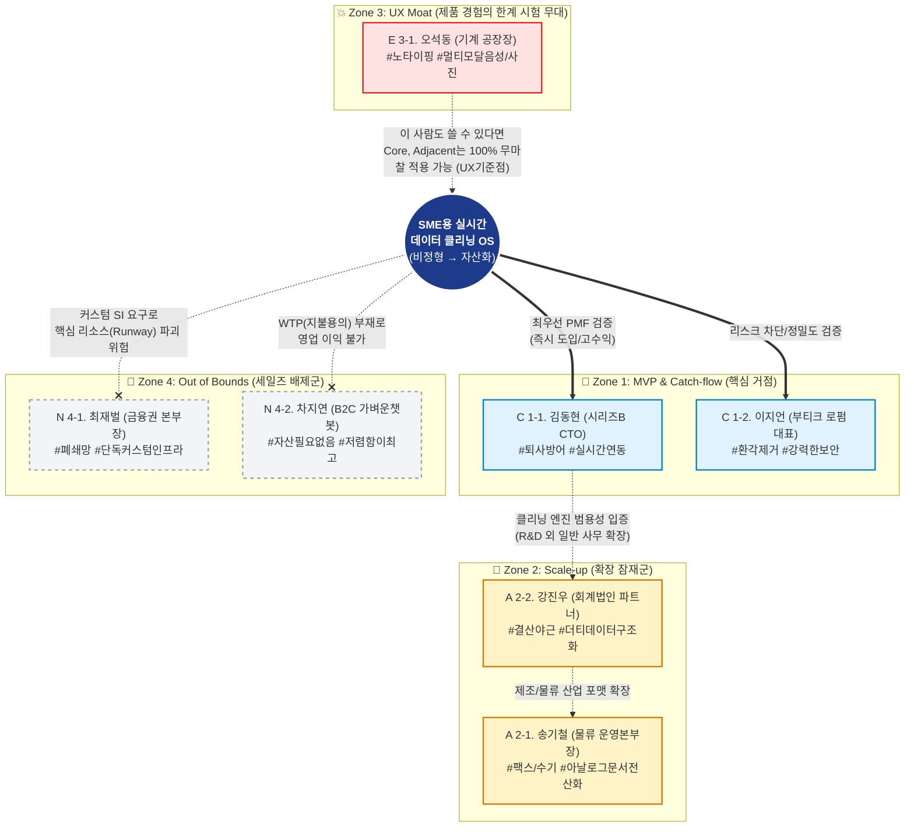
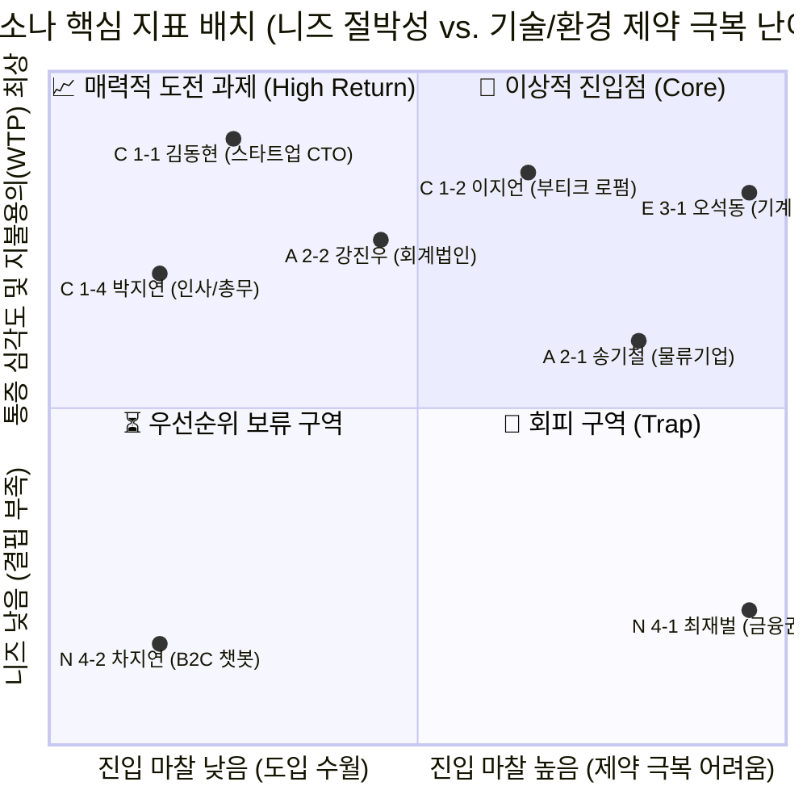

# 05. 페르소나 간 관계 구조화 및 스펙트럼 맵 (Persona Spectrum Map)

본 문서는 지금까지 분석한 **'SME용 실시간 데이터 클리닝 OS'**의 타겟 페르소나들을 제품을 중심으로 어떻게 포진되어 있는지 거리(Distance)와 관계(Relationship)를 시각화한 종합 맵입니다.

---

## 1. 페르소나 스펙트럼 생태계 도식화 (Flowchart)

제품(OS)의 본질적 가치로부터 **얼마나 가깝고 절실한가(Core)**, **어떻게 확장될 수 있는가(Adjacent)**, **어디까지 UX를 타협하지 말아야 하는가(Extreme)**, 그리고 **절대 넘지 말아야 할 선은 어디인가(Non-user)**를 나타냅니다.

---

## 2. 페르소나 상호작용 및 지표 기반 매트릭스 분석 (Matrix)

이동 역학(Dynamics)을 기준으로 당사의 한정된 자본(마케팅/개발 가용성)을 어떻게 분배해야 하는지 사분면(Quadrant)으로 확인합니다.

### [매트릭스 해석 및 제품 전략 구조화]

1. **상호작용 1 (Core ↔ Extreme) : 진입 장벽 분쇄**
   * **구조화**: 가장 WTP가 높은 `김동현(1-1)`을 타겟으로 API 백엔드를 고도화하되, 시스템 인터페이스(Front-End)는 가장 진입 제약이 큰 `오석동(3-1)`을 기준으로 하여 "마우스조차 쓰지 않는 Zero-config" 모드를 개발합니다. 
   * **효과**: 공장장님도 다루는 직관적인 솔루션은 김동현의 파견/신규 온보딩 개발자들도 '학습 스트레스 0'으로 즉시 수용하게 만들어 압도적인 락인(Lock-in) 효과를 봅니다.
   
2. **상호작용 2 (Core ↔ Adjacent) : 기술 해자의 수평선 확장**
   * **구조화**: 김동현(스타트업)이 겪는 R&D 문서화의 고통은 강진우(회계)가 겪는 수백 장 영수증 파편화 고통과 기술적 본질(비정형 → 정형 파싱)이 동일합니다. 
   * **효과**: 당사가 Core 시장에서 클리닝 엔진의 무결성을 증명하면, 프롬프트나 인지 모델만 갈아 끼워 Adjacent 시장으로 수평 전개가 무한히 가능해집니다.

3. **상호작용 3 (Core vs Non-user) : 세일즈 효율의 극대화**
   * **구조화**: 김동현을 만나는 세일즈 기간(약 2~4주) 대비, 시스템 인하우스를 고집하는 최재벌(4-1)은 최소 6개월을 소진시키고도 프로젝트를 드랍시킵니다.
   * **효과**: 이 구조도를 전사 영업조직(SDR/AE) 매뉴얼 최상단에 배치하여, '거대 레퍼런스(은행/대기업)'에 현혹되지 않고 우리 기업의 한정된 시간(Runway)을 보호합니다.

---
**[다온의 다음 제안]**
이 스펙트럼 맵의 심장인 **김동현 CTO**를 주인공으로 상정하고, 핵심 인력이 퇴사 의사를 밝힌 'Day 1'부터 당사의 OS가 도입되어 데이터 자산화가 완료되는 'Day 30'까지의 시나리오를 추적하는 **타겟 고객 여정 지도(Target Customer Journey Map)** 작성으로 실행 계획을 고도화해 보겠습니다.
