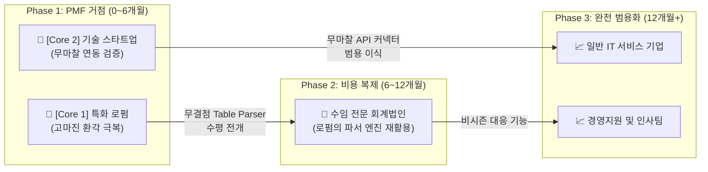
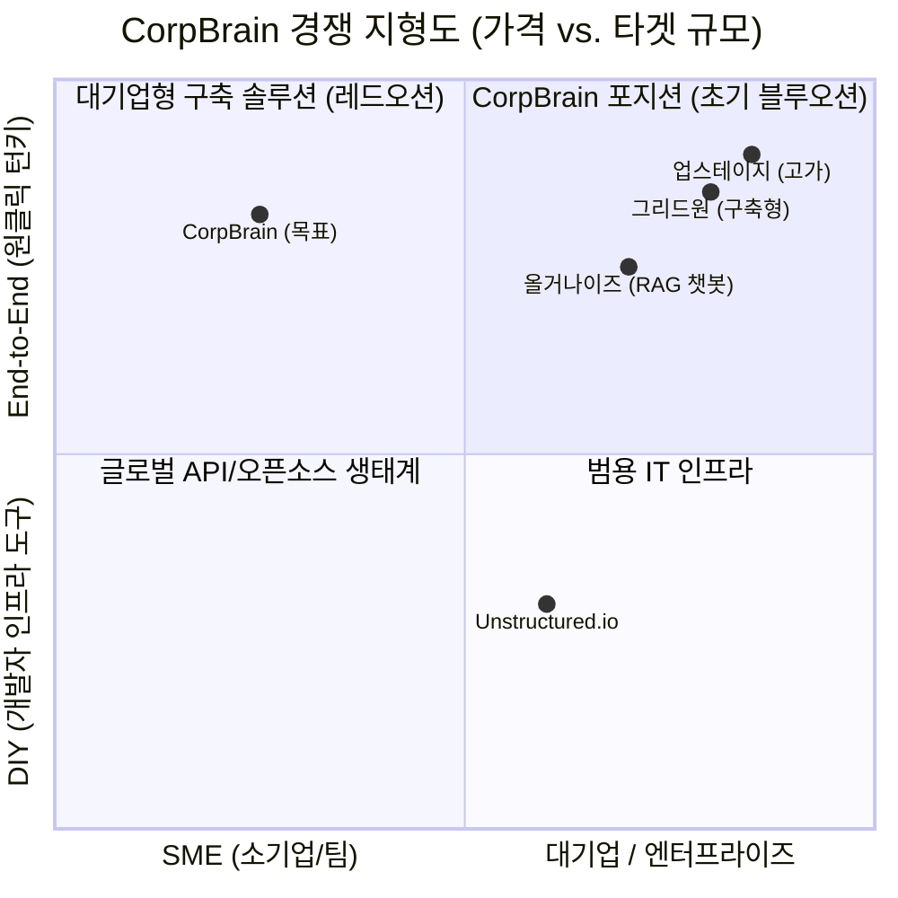

# 14_Value Proposition Sheet (최종 실무 & IR 통합 마스터)

**작성 목적**: 앞서 도출된 다각도의 비즈니스 분석(경쟁사, TAM-SAM-SOM, 여정 지도, 페르소나, AOS-DOS, JTBD)을 총망라하여 예비창업자 및 프로덕트 팀이 '최종 방향성'을 확정하는 마스터 문서입니다.
**문서 특징**: 직관적인 사업 요약(Executive Summary), 타겟별 깊이 있는 실무 기준(Deep-dive), 장기 IR 비전을 위한 전략 시각화(Visual Strategy)가 3개 버전의 장점을 취합하여 종합되었습니다.

---

## Part I. Executive Summary (사업 정의 및 요약 매트릭스)

### 1) 사업 한 줄 정의 (One-line Statement)
**CorpBrain은 기존에 사용 중인 업무 툴을 전혀 변경하지 않는 무마찰(Zero-Friction) 연동과, 표·서식을 100% 보존하는 무결점 파싱 및 오류 검증 UX를 통해, 문서가 파편화된 핵심 SME(중소기업) 조직의 비정형 데이터를 즉시 신뢰 가능한 자산으로 탈바꿈하는 실시간 데이터 클리닝 OS입니다.**

### 2) 핵심 타겟 고객 요약
| 구분 | 전략 대상 (Persona) | 타게팅 핵심 근거 (DOS) |
| --- | --- | --- |
| **Primary 1** | **부티크 특화 로펌 대표** (이지언) | 파싱 실패(환각)가 곧 법무 리스크로 직결되어 지불 여력 보장 (DOS 1위: 3.60) |
| **Primary 2** | **성장기 기술 스타트업 CTO** (김동현) | 빠른 퇴사율로 인한 레거시 파편화와 도입(RAG 구축) 저항이 가장 활발 (DOS 2위: 2.70) |
| **Secondary** | **회계법인 파트너 변호사** (강진우) | Core 검증 후 단순 포맷 변경만으로 진출할 수 있는 수익성 거점 (DOS 6위: 2.40) |
| **Non-target** | B2C, 대형 금융기관/엔터프라이즈 | 망분리 커스텀 SI 강요(런웨이 파괴 리스크) 혹은 지불 용의 부재로 인해 초기 진입 절대 배제 |

---

## Part II. 핵심 타겟별 가치 제안 상세 (Problem-Solution Fit)

> **활용처**: 개발팀(개발 백스토리 전달) 및 마케팅팀(세일즈 메시징)의 실무 기획 기준표

### 🎯 Segment A: 부티크 특화 로펌 대표 (오류율 0%를 위한 전투)
| VPS 항목 | 상세 서술 |
| :--- | :--- |
| **핵심 Pain** | **환각이 곧 파산** — 건설 하도급 등 복잡한 도표 양식이 범용 OCR에서 파괴되어 치명적 오판(단위 밀림 등) 발생. 100% 완벽한 망분리 요건 달성 부재. 주니어 변호사의 수작업 문서 대조에 막대한 인건비 소진. |
| **목표 (JTBD)** | *"중대 의사결정을 내릴 때, 1%의 구조 붕괴 없이 특수 서류를 빠르게 정형화하고자 함"*  **(Push)** 인건비 낭비와 수주 박탈 / **(Pull)** 로컬 구동과 완벽 유지 / **(Anxiety)** 데이터 외부 유출 공포 |
| **원하는 Outcome** | 수검수 소요 시간 87.5% 폭감(일평균 4h → 30min 이내) / 환각율 0건 통제 / 망분리 위반율 0% |
| **우리의 Value Prop** | **"단 하나의 셀(Cell)도 깨뜨리지 않는 무결점 구조화 엔진과, AI 스스로 의심스런 데이터를 붉게 띄우는 Confidence 하이라이터를 결합한 망분리 완전 호환 OS"** |
| **기존 대안 & 한계** | 대기업 중심 고비용 솔루션(업스테이지 등) 혹은 주니어 인력을 통한 수동 액셀러레이팅(워라밸 붕괴) |
| **차별적 가치** | **심리적 철벽(UX)**: 맹목적 전수검사를 지양하고, AI 확신도 80% 미만만 붉게 표기하여 '인간이 개입할 구간'만 던져주는 심리적 락인 UX 제공. |

### 🎯 Segment B: 시리즈 B 스타트업 CTO (마찰 없는 지식 파종)
| VPS 항목 | 상세 서술 |
| :--- | :--- |
| **핵심 Pain** | **퇴사시 시스템 블랙박스화** — 핵심 개발자 이탈 시 Slack, Github 등에 흩어진 레거시 단절. 중앙 툴 이주를 강제. RAG 시도 시 구버전(쓰레기) 데이터 유입으로 치명적 버그 발생. |
| **목표 (JTBD)** | *"레거시 유실 위기 시, 직원들에게 새 툴 체제 학습 마찰을 주지 않고 최신 지식만 남긴 RAG를 원함"*  **(Push)** 쓰레기 RAG 사고 / **(Pull)** 구버전 필터링 / **(Habit)** 사일로 도구 선호 / **(Anxiety)** 예상 못한 API 과금 |
| **원하는 Outcome** | 쓰레기 폴더 필터링 자동화 극대화 / 온보딩 소요 기간 주 단위 → 일/시간 단위 압축 / 마이그레이션 마찰 '제로(0)'화 |
| **우리의 Value Prop** | **"임직원이 기존에 쓰던 툴을 단 하나도 바꾸지 않고, 백그라운드 API 연동으로 구버전 문서를 알아서 솎아내는 무마찰(Zero-Friction) 데이터 클렌징 엔진"** |
| **기존 대안 & 한계** | Unstructured.io 등 개발자 특화 인프라이나 직접적인 클렌징 및 무마찰 UX 부재. 팀장 수작업 마이그레이션. |
| **차별적 가치** | **Zero-Friction 동기화 원칙**: 임직원 행동 양식을 건드리지 않고, 기존 권한들을 백그라운드 API 증분 호출로만 모니터링하여 예측 가능 비용 체계 유지. |

---

## Part III. MVP 백로그 및 로드맵 (JobMVP)

| 우선도 | 기능명 (JobMVP Feature) | 대상 & 이유 (왜 먼저인가?) | 해결하는 고통 (DOS) |
| :---: | :--- | :--- | :--- |
| **P 1** | **무결점 Table & Form 파서 코어** | **로펌·회계(A1)** — 원본 문서의 틀 보존은 GPT와의 차별화이자 초기 결제를 당기는 최중요 기술 해자 | 파싱 실패 (DOS 3.60) |
| **P 2** | **Confidence 에러 하이라이터 UX** | **로펌(C2)** — 파싱된 데이터에서 의심 구간만 집중 검수시키는 신뢰 구축 트리거 | 오류 색출 불신 (DOS 3.20) |
| **P 3** | **1-Click API 백그라운드 커넥터** | **CTO(B1)** — Slack, Github 뒷단에서 증분만 가져와 임직원의 생태계 이동 마찰을 줄임 | 파편화 및 단절 (DOS 2.70) |
| **P 4** | **PII 오토 마스킹 (블라인드)** | **공통** — B2B 공급을 위한 필수 사내 보안 컴플라이언스와 망분리 신뢰 획득 요건 | 정보 유출 불안 (DOS 2.70) |

*(※ Zero-config 음성/사진 입력기는 제조업의 수용성이 낮아 DOS 0.96으로 측정되어, 초기 런웨이 보호를 위해 개발 우선순위에서 완전히 배제함)*

---

## Part IV. GTM 전략 및 투자자(IR) 커뮤니케이션 부록

> **활용처**: 초기 자금 유치를 위한 비전 발표, 팀 빌딩 및 오퍼레이션 방향 설정

### 부록 1. Go-To-Market 단계별 확장 시퀀스 (동심원형 스케일업)

### 부록 2. 경쟁사 포지셔닝 맵 (빈 영토 선점)

### 부록 3. 콜드콜 세일즈 1장 기획서 (피칭 멘트)

| 설득 흐름 | 이지언 (부티크 로펌 대표) 타겟 강력한 멘트 | 김동현 (성장 스타트업 CTO) 타겟 강력한 멘트 |
| :--- | :--- | :--- |
| **1. Hook (고통)** | "주니어 변호사분들이 OCR 대조 작업하느라, 한 달에 수주할 수 있는 최고급 딜 3개를 날리고 계십니다." | "핵심 개발자 나갔을 때 시스템 히스토리가 블랙박스 돼서 한 달 치 스프린트가 붕괴되지 않았나요?" |
| **2. Solution (해소)** | "표가 1%도 밀리지 않는 전처리 엔진입니다. 변호사는 붉은색 표시만 리뷰하고 바로 전략회의 시작하세요." | "팀원들에게 새로운 툴을 쓰라고 지시할 필요 없습니다. Slack 백그라운드에 연결만 하시면 됩니다." |
| **3. Call to Action** | **"마스킹 처리된 지난주 실사 보고서 50장만 올려보시겠습니까?"** | **"사내 제일 복잡한 노션 워크스페이스 하나만 API 꽂아 보시겠습니까? 5분이면 됩니다."** |

### 부록 4. 반드시 피해야 할 '안티패턴' (사망 선고 3요소)

1. **"거대 금융사 레퍼런스"의 유혹**: 망분리 커스텀 SI 구축을 강요하는 금융사 제안 통과 즉시 드랍 (엔진 고도화 시간 상실 방어).
2. **"감동적인 스토리"에 속아 스펙 비대화**: 제조업(공장)의 고통이 극심해도 조직 채택률 속도(MR 0.3)가 최악이므로 절대 런웨이 투입 금지.
3. **"무료 B2C 사용자" 수용**: 범용 지식 챗봇 수요자는 WTP(지불 용의)가 0에 수렴. 이메일 도메인 필터링 필수 조치.

---

## Part V. 다온의 예비창업자 실무 코멘트

> "회비서님, 6단계에 걸친 꼼꼼한 마켓 분석과 검증이 이 한 장으로 완벽히 병합되었습니다. 이제 더 이상의 캔버스 작성과 리서치는 필요하지 않습니다. **개발팀이 키보드를 잡기 전에, 위의 [부록 3. 콜드콜 피칭 서식]을 가지고 이지언 대표와 김동현 CTO의 명함을 파서 무작정 전화를 걸어야 할 타이밍입니다.** 그들이 고개를 끄덕이면 코드를 짜고, 고개를 젓는다면 문서를 다시 써야 합니다."
