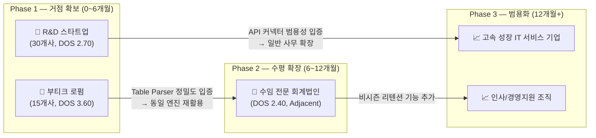
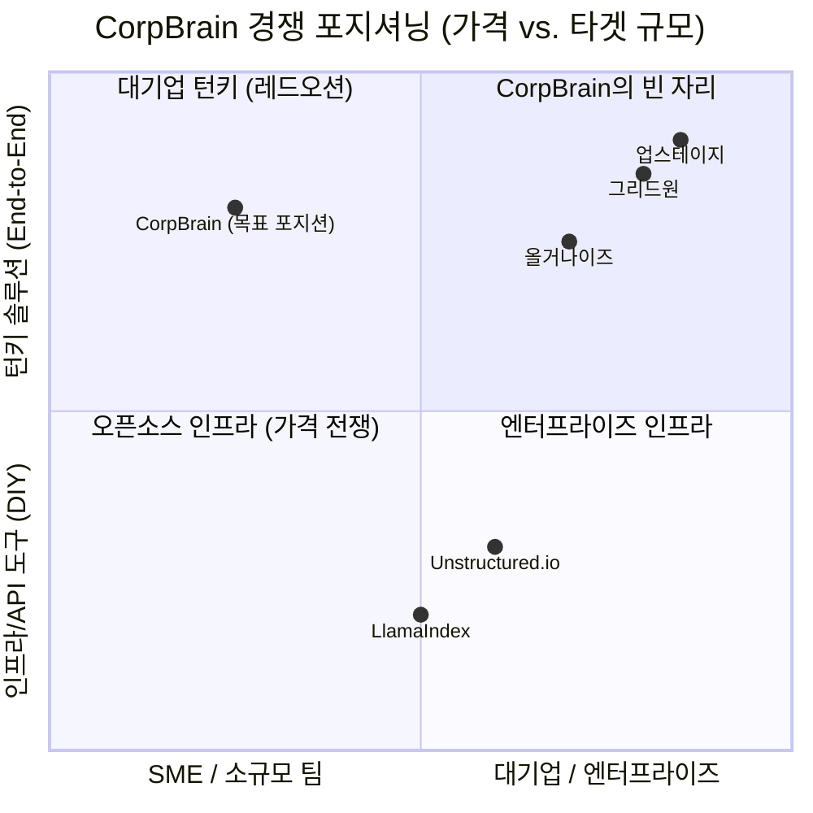

# Value Proposition Sheet — CorpBrain (SME용 실시간 데이터 클리닝 OS)

> **문서 성격**: 본격 신규 사업을 처음 기획하는 예비창업자를 위한 가치 제안 통합 명세서
> **분석 기반**: 경쟁사 분석 · TAM-SAM-SOM · 페르소나 스펙트럼 맵 · 고객 여정 지도 · AOS-DOS 결합 평가 · JTBD 가상 심층 인터뷰
> **작성 방법론**: `8_ValueProposition_Sheet_작성방법.md` (페르소나·JTBD 기반 통합 문서 구성)

---

## 0. 사업 한 줄 정의

**CorpBrain은 문서와 파일이 파편화된 SME가 핵심 지식과 업무 데이터를 잃지 않도록, 무마찰 연동과 무결점 파싱, 검수 보조 UI를 통해 비정형 데이터를 신뢰 가능한 자산으로 바꿔주는 실시간 데이터 클리닝 OS이다.**

이 정의는 "고객이 누구인지 · 어떤 문제를 얼마나 심하게 겪는지 · 우리 솔루션이 무엇을 바꾸는지"를 한 문장에 담은 것입니다.

---

## 1. 타깃 고객 요약 매트릭스

> 💡 **다온 코멘트**: 회비서님, 초창기 창업 리소스는 매우 한정되어 있습니다. 거창한 만능 비전보다는 '당장 고객이 지갑을 열게 만들 뾰족한 가치'에 집중해야 합니다. 본 시트는 환각 공포에 시달리는 **[부티크 로펌]**과 지식 유실에 직면한 **[기술 스타트업]** 두 가지 핵심 거점 시장(Target Core)별로 분리 작성되었으며, 확장 타겟으로 **[회계법인]**을 별도 정리하였습니다.

| 구분 | 핵심 대상 | 왜 이 고객인가 |
| :--- | :--- | :--- |
| **Primary 1** | **부티크 특화 로펌 대표 / 파트너 변호사** | 표·특수양식 파싱 실패가 곧 법적 리스크. 보안 민감도와 지불 의사(WTP)가 가장 높습니다. DOS 전체 1위. |
| **Primary 2** | **시리즈 B R&D 스타트업 CTO** | 레거시 지식 단절, 퇴사 블랙박스화, 툴 분절 문제가 직접 매출 손실로 연결됩니다. 도입 속도도 빠릅니다. DOS 전체 2위. |
| **Secondary** | **수임 전문 회계법인 파트너** | 시즌성 문서 대량 처리와 ERP 연동 수요가 강해, Core 검증 후 확장하기 좋은 세그먼트입니다. DOS 6위. |
| **Non-target** | **대형 금융권 / B2C / 단순 챗봇 수요** | 망분리 강박(DOS 0.00), 낮은 WTP(DOS 0.04), 범용 챗봇 대체 가능성으로 초기 사업 타겟에서 제외. |

---

## 2. 고객이 겪는 핵심 문제 (Pain) 요약

| 고객군 | Pain | 현 상태의 문제 |
| :--- | :--- | :--- |
| 로펌 | 표와 특수 양식이 깨지면 의사결정 자체가 위험해짐 | 주니어가 수작업으로 4시간 이상 검수·재입력하며, 실수 한 번이 치명적입니다. |
| CTO | 퇴사·온보딩 때 문서와 지식이 파편화되어 블랙박스화 | Slack, GitHub, Notion이 분절되어 최신 문서를 가려내기 어렵고, 잘못된 버전이 사고를 냅니다. |
| 회계법인 | 영수증·장부·증빙의 양식이 너무 다양함 | 시즌마다 반복 작업이 폭증하고, 기존 OCR/RPA만으로는 실무 검수가 끝나지 않습니다. |

---

## 3. 핵심 가치 제안 시트 — 타겟별 상세 (Problem–Solution Fit)

> 각 고객은 서로 다른 상황(Situation)에서 서로 다른 고통(Pain)을 겪고 있으므로, 하나의 만능 VP가 아닌 **고객별로 뾰족하게 다듬어진 가치 제안**이 필요합니다.

---

### 📌 Segment A: 부티크 특화 로펌 대표 — 이지언
*DOS 1위 (3.60) · SOM 15개사 · 연 매출 기여 목표 18.7억 원*
*데이터 유출과 문서 오판이 기업 생존을 좌우하는 전문 고수익 직군*

| 항목 | 내용 |
| :--- | :--- |
| **페르소나 및 CJM 방식의 고객별 핵심 문제 서술 (Pain, Needs)** | **[Pain 1] 환각이 곧 소송 패배다** — 범용 AI/OCR이 건설 하도급 계약서의 복잡한 도표 양식을 텍스트 한 줄로 뭉뚱그려 파괴함. 자산 실사 보고서의 재무제표에서 단(段) 단위가 밀려 잘못된 금액으로 실사 의견이 나갈 뻔한 사고 경험 보유. *"숫자 한 번 밀리면 실사 보고서 하나로 로펌 문 닫습니다."* (CJM 문제인식 단계 감정: 분노·공포)<br><br>**[Pain 2] 주니어 변호사의 값비싼 시간이 복사-붙여넣기에 소진된다** — 주니어 변호사 3명이 매일 4시간씩 원본-OCR 결과를 대조하며 수기로 엑셀에 옮겨 적는 워크어라운드 수행 중. 이로 인해 고부가가치 딜에 투입될 리소스가 부족해져 수주 기회를 복수 회 상실.<br><br>**[Pain 3] 망분리가 깨지면 파산이다** — 민감 정보(주민번호, 계약 금액) 유출 시 로펌 존립 자체를 위협하는 법적 리스크. 클라우드 솔루션에 대한 원초적 불신. (CJM 의사결정 단계 감정: 강박) |
| **JTBD 관점 인터뷰 결과에 따른 고객 상황에 따른 목표 서술 (Goal, Job)** | **Job Statement**: *"복잡한 도표가 포함된 계약서나 판례를 기반으로 긴급하고 중대한 법률적 의사결정을 내려야 할 때, 단 1%의 정밀도 손실(표/구조 붕괴)도 없이 특수 양식을 완벽한 정형 데이터로 빠르게 구조화하고자 함."*<br><br>**Situation (전환 트리거)**: 잘못된 OCR 인식으로 인한 대형 소송 오판 위기를 직접 경험한 시점<br>**4 Forces 요약**:<br>• **Push** — 수작업 매몰로 수주 기회 박탈<br>• **Pull** — 100% 로컬 + 도표 완벽 파싱의 조합<br>• **Habit** — "AI 결과도 어차피 전수 검사해야 직성이 풀림"<br>• **Anxiety** — 로컬 내 다른 프로그램과의 충돌·정보 유출 |
| **고객이 원하는 Outcome** | 1. 문서 수작업 검수 시간: **일 4시간 → 30분 이내** (87.5% 감소)<br>2. 표/특수 양식 내 텍스트 환각·오표기: **0건 통제**<br>3. 사내망(망분리) 위반율: **0%** (100% 로컬 처리) |
| **우리 솔루션의 핵심 제안 (Value Proposition)** | **"법무·회계 전문직의 특수 양식을 단 하나의 셀도 깨뜨리지 않는 무결점 구조화 엔진과, AI 스스로 의심스러운 데이터를 표시하는 Confidence 하이라이터를 결합한 망분리 완전 호환 데이터 클리닝 OS"** |
| **기존 대안 (Competitor / Substitute)** | **직접 경쟁**: 업스테이지(Document Parse) — 금융·보험 대기업 타겟, 최소 도입 비용이 SME 예산을 초과. 올거나이즈(Alli) — RAG 중심 챗봇으로 '파싱 정밀도' 자체는 핵심 소구점이 아님.<br>**간접 대체재**: 주니어 변호사 3명 × 일 4시간 수작업 (인건비 연 약 7,200만 원 이상 추정).<br>**시장 공백**: 5개 경쟁사 모두 대기업·금융 타겟에 집중. **SME 전문직 법인의 비용 구간(연 1,000~3,000만 원)에 맞는 전용 솔루션은 부재.** |
| **우리가 제공하는 차별적 가치** | 1. **정밀도 해자**: 범용 GPT나 오픈소스 파서가 포기하는 '표 내부의 셀 경계·병합·주석' 구조를 원본 그대로 복원하는 전용 파싱 로직. 이것이 "CorpBrain ≠ ChatGPT"의 분기점.<br>2. **심리적 안전망 UX**: AI 컨피던스 80% 미만 데이터를 붉은색으로 하이라이트 → 사람은 붉은색만 확인. 전수 검사 강박 해소와 검수 시간 단축을 동시에 달성.<br>3. **가격 접근성**: 대기업향 솔루션(연 수억 원) 대비 1/10 이하 비용 구간에서 동등 이상의 정밀도를 SME에게 제공. |
| **Proof (근거 / 검증 데이터)** | **정량**: AOS = 4.0 (니즈 긴급도 전체 1위) · DOS = 3.60 (시장성·수익성 전체 1위) · Importance 5 / Satisfaction 1 (최대 미충족 갭)<br>**정성**: *"붉은색 표시만 집중 검수하면 되니까, 심리적 방어선이 구축됨과 동시에 검수 시간이 압도적으로 줄어듭니다. 그 기능이 제대로 엑셀에 뽑혀 나온다면 즉시 유료 도입합니다."* — JTBD 인터뷰 중 이지언 대표 발언 |

---

### 📌 Segment B: 시리즈 B 기술 스타트업 CTO — 김동현
*DOS 2위 (2.70) · SOM 30개사 · 연 매출 기여 목표 28.6억 원*
*핵심 인력 퇴사 빈도가 높고 사내 시스템 및 소통 툴이 다수 파편화된 기술 조직*

| 항목 | 내용 |
| :--- | :--- |
| **페르소나 및 CJM 방식의 고객별 핵심 문제 서술 (Pain, Needs)** | **[Pain 1] 퇴사자가 나가면 레거시 지식이 블랙박스가 된다** — 핵심 개발자 2명 동시 퇴사 시 시스템 히스토리 전체가 유실, 한 달 치 스프린트가 그대로 증발한 경험 보유. *"이 사람 나가면 기존 레거시는 누가 파악하지?"* (CJM 문제인식 단계 감정: 불안·막막함)<br><br>**[Pain 2] RAG를 시도했으나 '쓰레기 투입 → 쓰레기 산출'** — 랭체인 기반 사내 위키를 구축했으나 중복·구버전 API 문서가 섞여 신규 입사 개발자가 옛날 명세로 코딩 → 프로덕션 버그 → 며칠 밤 롤백 사태 경험.<br><br>**[Pain 3] 중앙 통제 시스템을 강요하면 개발자들이 반발한다** — 각자 편한 사일로 툴(Slack, Github, Notion)에 고립되길 좋아하는 개발 문화. 중앙 플랫폼 이주 시도 시 "엄청난 불만과 저항"에 부딪힘. |
| **JTBD 관점 인터뷰 결과에 따른 고객 상황에 따른 목표 서술 (Goal, Job)** | **Job Statement**: *"인력 교체기 혹은 급격한 온보딩 시점에 파편화된 암묵적 지식이 블랙박스화될 위기에 직면했을 때, 임직원에게 새로운 툴 학습이라는 마찰을 주지 않으면서도 흩어진 정보를 통합해 신뢰할 수 있는 사내 RAG/위키를 구축하고자 함."*<br><br>**Situation (전환 트리거)**: 핵심 인력 퇴사로 레거시 지식이 단절되어 스프린트가 통째로 지연되는 금전적 피해 시점<br>**4 Forces 요약**:<br>• **Push** — 쓰레기 데이터 RAG가 프로덕션 사고를 유발<br>• **Pull** — 구버전 자동 필터링 + 최신 유효 문서만 큐레이션<br>• **Habit** — 사일로 툴에 머물고자 하는 개발자들의 강한 저항<br>• **Anxiety** — 기존 API 권한 체계 붕괴 + 예상 밖 과금 폭탄 |
| **고객이 원하는 Outcome** | 1. 구버전·쓰레기 파일 필터링 정확도: **자동화율 극대화**<br>2. 신규 입사자 온보딩·인수인계 시간: **주 단위 → 시간 단위** (약 85% 감소)<br>3. 기존 툴 연동 시 마찰 비용: **제로** (개발자 행동 변경 요구 없음) |
| **우리 솔루션의 핵심 제안 (Value Proposition)** | **"개발자가 쓰던 툴을 단 하나도 바꾸지 않고, 백그라운드에서 구버전·중복 문서를 자동 솎아내어 '살아있는 지식'만 남기는 무마찰(Zero-Friction) 데이터 클렌징 엔진"** |
| **기존 대안 (Competitor / Substitute)** | **직접 경쟁**: Unstructured.io — 범용 파이프라인이나 직접 데이터 '클렌징 로직'은 미제공. LlamaIndex — 인프라 프레임워크로 '무엇을 버릴지' 판단은 고객 몫.<br>**간접 대체재**: 팀장이 수작업으로 Slack/Notion 링크를 긁어 스프레드시트에 수동 정리.<br>**시장 공백**: 글로벌 인프라 도구들은 '수집·파싱'에 집중하되 **'구버전/중복 문서의 의미 기반 식별 및 정리'라는 클렌징 레이어는 방치.** |
| **우리가 제공하는 차별적 가치** | 1. **Zero-Friction 설계 원칙**: 임직원에게 새 도구 학습을 강요하지 않음. Slack·Github·Notion 뒤편에서 API 호출만으로 변경분/추가분을 증분(incremental) 수집.<br>2. **데이터 클렌징 중심 사고**: '더 많이 모으는' RAG가 아니라 '쓰레기를 골라내는' OS. 구버전·중복·사장된 문서의 자동 판별 로직이 핵심 차별점.<br>3. **예측 가능한 비용**: 증분 동기화 방식으로 불필요한 API 트래픽 최소화. CTO의 과금 불안 해소. |
| **Proof (근거 / 검증 데이터)** | **정량**: AOS = 3.0 · DOS = 2.70 · MR(시장 연관도) = 0.9 (최상위, SOM 내 R&D 스타트업이 30개사로 최대 세그먼트)<br>**정성**: *"불필요한 과금 없이 딱 필요한 업데이트 내용만 긁어와 준다면 최고의 솔루션이네요. 개발자들이 툴을 바꿀 필요도 없다면 당장 팀 계정으로 결제하겠습니다."* — JTBD 인터뷰 중 김동현 CTO 발언 |

---

### 📌 Segment C (확장 타겟): 수임 전문 회계법인 파트너 — 강진우
*DOS 6위 (2.40) · Adjacent Zone · Core 검증 후 수평 확장 대상*

| 항목 | 내용 |
| :--- | :--- |
| **핵심 문제 (Pain, Needs)** | 종합소득세 시즌마다 제각각인 수기 장부·영수증이 폭주. 기존 OCR은 영수증 내 표가 다 깨져서 결국 재검수 필수. 주니어 회계사가 밤새 엑셀 타이핑하다 이직 → 시즌마다 반복. (CJM 문제인식 단계 감정: 압박감) |
| **JTBD 목표 (Goal, Job)** | **"양식이 제각각인 증빙을 빠르게 구조화해, 결산과 신고 마감 시간을 줄이고 싶다."** |
| **고객이 원하는 Outcome** | 1. 결산 마감 기간: 작년 대비 **50% 단축**<br>2. 다양한 폼(Free-form) 영수증에서 금액/날짜 **100% 매핑**<br>3. 출력 결과물의 회계 표준 포맷(XML, CSV) 및 메이저 ERP 호환 |
| **핵심 제안 (Value Proposition)** | Core(로펌)에서 검증된 **무결점 Table Parser 엔진을 영수증/증빙 양식으로 확장 적용**, 회계 표준 포맷 내보내기 지원 |
| **왜 "확장 타겟"인가** | 로펌과 회계법인은 둘 다 '특수 양식(표)의 정밀 파싱'을 요구함. 기술 본질이 동일하므로 프롬프트/스키마만 교체하면 수평 전개 가능. 단, 명확한 시즌성이 있어 비시즌 리텐션 전략이 필요. |

---

## 4. 기존 대안 종합 비교 (Competitor / Substitute)

| 대안 | 한계 |
| :--- | :--- |
| 범용 OCR / 문서 파서 | 표·차트·특수 서식을 깨뜨리기 쉽고, 전문직 실무에서 바로 쓰기 어렵습니다. |
| 수동 엑셀 정리 | 정확성은 높일 수 있지만, 비용과 시간이 너무 큽니다. (로펌 기준 인건비 연 약 7,200만 원 이상 추정) |
| 글로벌 전처리 플랫폼 (Unstructured.io, LlamaIndex) | 인프라·개발자 친화적이지만, SME의 레거시 파일 정리와 도입 마찰 해소에는 직접적이지 않습니다. |
| 버티컬 엔터프라이즈 솔루션 (Upstage, Allganize, GridOne) | 대기업·규제 산업 중심으로 강하지만, SME 초기 진입에는 비용과 구조가 너무 무겁습니다. |

---

## 5. 차별적 가치 요약

| 차별점 | 의미 |
| :--- | :--- |
| **기존 툴을 바꾸지 않음 (Zero-Friction)** | 사용자의 학습 저항을 줄이고 도입 속도를 높입니다. |
| **최신/유효 데이터만 선별 (클렌징 중심)** | CTO 세그먼트의 "쓰레기 문서" 문제를 직접 해결합니다. |
| **Confidence Score 기반 검수 UX** | 전문직이 불안해하는 환각/오류를 시각적으로 통제합니다. |
| **SME 맞춤 가격·시장 포지션** | 대형 엔터프라이즈 경쟁을 피하고, 실제 도입 가능한 비용 구간(연 1,000~3,000만 원)의 빈 시장을 노립니다. |

---

## 6. 통합 VP 선언문 — 한 문장 요약

> 투자자 미팅, 랜딩 페이지 헤드라인, 세일즈 덱 표지에 직접 활용할 수 있습니다.

**CorpBrain은, 핵심 인력 퇴사와 AI 환각이라는 두 가지 생존 위협에 직면한 중소 전문직 법인과 기술 스타트업을 위해, 기존 업무 환경을 전혀 바꾸지 않으면서도 파편화된 비정형 데이터를 무결점으로 구조화하고 쓰레기 데이터를 자동으로 솎아내는, SME 전용 실시간 데이터 클리닝 OS입니다.**

**→ 이 사업의 본질은 "문서를 잘 읽는 기술"이 아니라, "고객이 믿고 바로 업무에 쓸 수 있는 자산으로 바꾸는 능력"입니다.**

---

## 7. JobMVP Feature Map (기능 우선순위 정리)

상기 VP를 기술적으로 실현하기 위해 당장 만들어야 할 제품(MVP)의 백로그 우선순위입니다. 순서는 **DOS(시장 파괴력) × 기술 의존성**을 결합하여 확정하였으며, 기능들은 철저히 **시장 매력도와 지불 용의(DOS)가 보증된 순서**로 나열되었습니다.

| 우선순위 | MVP Feature | 해결 대상 (Pain ID) | DOS | 대상 세그먼트 | 선후 의존성 | 기대 효과 및 구현 맥락 |
| :---: | :--- | :--- | :---: | :--- | :--- | :--- |
| **P1** | **무결점 Table & Form Parser** | C2, CJM-2, A1 | **3.60** | 로펌 (1차) → 회계 (확장) | 없음 (최선행 기반) | 텍스트만 긁어내는 수준을 넘어 원본 문서의 틀과 셀 매트릭스를 100% 보존. 대규모 범용 오픈소스(GPT 포함)와 당사 솔루션을 차별화 짓는 최초의 기술적 해자. |
| **P2** | **Confidence Score 에러 하이라이터 UI** | CJM-5 | **3.20** | 로펌 (결제 트리거) | P1에 의존 (파싱 결과의 신뢰도 점수 필요) | AI가 추론 신뢰도가 떨어지는 구역만 컬러링. 인간(전문가)이 병목 구역만 전수 검수하게 유도함으로써 AI 맹신 공포를 지우는 가장 즉각적인 세일즈 기믹(결제 유도 무기). |
| **P3** | **One-Click API 백그라운드 커넥터** | C1, CJM-4 | **2.70** | 스타트업 CTO | P1 활용 (수집 데이터의 클렌징 처리) | Slack, Github 등 기존 워크스페이스의 데이터를 백그라운드에서 증분(수정본)만 추적하여 최신화. 임직원의 '행동 변화(이주)' 마찰을 완전히 제거하는 핵심 브릿지 장치. |
| **P4** | **PII 오토 마스킹 & 하이브리드 배포** | CJM-3 | **2.70** | 공통 (컴플라이언스) | P1 후처리 단계 | 고객 온프레미스/VPC 배포 시 민감 정보를 자동 블라인드 처리. B2B 엔터프라이즈의 기초 Compliance 장벽을 뚫기 위해 필수불가결. |
| **Drop** | *(개발 보류)* Zero-config 카메라/음성 모듈 | E1 | **0.96** | 오석동 (제조업) | — | DOS 지표 상 시장 확산성이 최하(0.96). 타겟의 결핍은 강렬하나 해당 생태계의 채택 속도(MR 0.3)가 느려 런웨이에 치명상. Q2 니치 트랩으로 간주해 보류. |

**핵심 의존성 구조**:
```
[P1: Table Parser] ──────────────────────┐
       │                                 │
       ▼                                 ▼
[P2: Confidence UI] ← 신뢰도 점수 의존    [멀티포맷 어댑터 (회계 확장)]
       │
       ▼
[P4: PII 마스킹] ← 파싱 결과물 후처리
       │
       ▼
[P3: API Connector] ← 마스킹된 데이터의 안전한 연동
```

→ **P1(파서)이 모든 후속 기능의 기반입니다. P1 없이 P2~P4는 존재할 수 없으며, P1의 품질 확보가 전체 사업의 성패를 결정하는 단일 병목(Single Point of Failure)입니다.**

---

## 부록 A. 세그먼트 간 확장 경로 (Go-To-Market Sequence)

본 사업의 시장 진입은 '동심원 확장(Concentric Expansion)' 전략을 따릅니다.



**확장 논리**: 
- **로펌 → 회계법인**: 둘 다 '특수 양식(표)의 정밀 파싱'을 요구함. 기술 본질이 동일하므로 프롬프트/스키마만 교체하면 수평 전개 가능.
- **스타트업 → IT 서비스 기업**: 둘 다 'API 기반 다중 툴 연동'을 요구함. 커넥터 목록 확장만으로 시장 확대.
- 이 경로를 역행(예: 제조업부터 시작)하면 DOS 0.96의 늪에 빠져 런웨이가 소진됩니다.

---

## 부록 B. 절대 하지 말아야 할 3가지 (Anti-Pattern Checklist)

예비창업자가 가장 흔하게 빠지는 함정을 사전에 방어합니다.

| # | 함정 (Anti-Pattern) | 근거 (데이터 출처) | 방어 행동 |
| :---: | :--- | :--- | :--- |
| 1 | **"대기업 레퍼런스"에 현혹되어 SI 수주 수락** | Non-user 4-1 최재벌: 미팅 6개월 소진 후 드랍, DOS = 0.00 (페르소나 스펙트럼 맵) | 영업 매뉴얼 최상단에 금융권·대기업 블랙리스트 등록. "당사는 SI 외주 불가" 원칙 명문화 |
| 2 | **"감동적인 Pain" 기반으로 MVP 스펙 비대화** | Extreme 3-1 오석동: AOS 3.2(고통 극심)이나 DOS 0.96(돈 안 됨). 제조업 디지털 채택률 MR = 0.3 | "고통이 크다 ≠ 시장이 있다"를 팀 전원이 체화. AOS만으로 백로그에 올리지 말 것 |
| 3 | **WTP 없는 B2C 유저에게 무료 트라이얼 제공** | Non-user 4-2 차지연: 챗GPT 월 2만 원으로 충분, DOS = 0.04 | B2C 이메일 도메인(gmail 등) 가입 차단 또는 저가형 Self-serve 전용 트랙으로 격리 |

---

## 부록 C. 경쟁사 대비 포지셔닝 맵



**포지셔닝 해석**:
- **Q1(좌상단, SME × 턴키)은 현재 비어 있습니다.** 기존 경쟁사들은 모두 우하단(대기업 × 인프라)이나 우상단(대기업 × 턴키)에 밀집.
- CorpBrain은 이 공백을 점거하되, '턴키'의 의미를 '복잡한 구축'이 아닌 **'원클릭 셋업 + 즉시 결과 확인'**으로 재정의함.
- 이 포지션은 경쟁사의 기존 BM(고비용 SI/API 과금)과 정면 충돌하지 않으므로, 초기 스타트업의 한정된 자원으로도 방어 가능.

---

## 부록 D. 솔루션 핵심 가치 1장 요약 (세일즈 덱·IR 활용)

| 구분 | 부티크 로펌 대표에게 말할 때 | 기술 스타트업 CTO에게 말할 때 |
| :--- | :--- | :--- |
| **공포 자극 (Push)** | "지금 수작업 대조에 주니어 연봉의 절반을 태우고 계십니다." | "다음 핵심 인력이 나가면, 지난번처럼 한 달이 아니라 분기가 날아갑니다." |
| **비전 제시 (Pull)** | "매일 아침 대조 작업 대신, 붉은색 표시만 확인하고 바로 전략 회의를 시작하세요." | "개발자 한 명도 툴을 바꾸지 않았는데, 신규 입사자가 첫날부터 코드를 칩니다." |
| **불안 해소 (Anxiety)** | "100% 로컬 망분리. 데이터는 사무실 밖을 한 발짝도 나가지 않습니다." | "증분 동기화로 API 과금 캡이 보장됩니다. 예상 밖 청구서는 없습니다." |
| **전환 요청 (CTA)** | "이번 주 금요일, 귀사의 실제 계약서 10건으로 무료 PoC를 진행하시겠습니까?" | "Slack 워크스페이스 하나만 연결해 보시겠습니까? 5분이면 됩니다." |

---

## 부록 E. 예비창업자를 위한 전략적 보강 항목

### E-1. 사업 운영 가설

| 항목 | 권장 내용 |
| :--- | :--- |
| **사업 포지셔닝** | "문서를 읽는 AI"가 아니라 **"업무 가능한 데이터로 바꾸는 OS"**로 정의하는 것이 좋습니다. 경쟁사와의 차별점이 선명해집니다. |
| **초기 고객 확보 방식** | 로펌과 시리즈 B CTO를 양쪽에서 동시에 노리되, 실제 첫 매출은 **환각 리스크가 치명적인 전문직**에서 만드는 편이 빠릅니다. |
| **수익모델 가설** | 초기에는 도입비 + 구독형 + 문서량 기반 과금을 혼합하고, 나중에 연동 수와 보안 옵션으로 확장하는 구조가 자연스럽습니다. |
| **검증 지표 (KPI)** | 정확도, 수작업 절감 시간, 온보딩 시간, 검수 전환율, 도입 후 재사용률을 반드시 봐야 합니다. |
| **제외 전략** | 금융권 대형망, B2C 챗봇, 과도한 SI 커스텀 요구는 초기에 버려야 런웨이를 지킬 수 있습니다. |

### E-2. 다온의 전략 어드바이스

> 회비서님, 본 문서는 '분석의 종착점'이 아니라 **'실행의 출발점'**입니다.

1. **코드보다 콜드콜이 먼저입니다.** 본 VP Sheet의 '1장 요약(부록 D)'을 들고 실제 부티크 로펌 대표 또는 시리즈 B CTO에게 콜드콜 미팅을 잡으십시오. 그들이 고개를 끄덕이는 순간이 진짜 PMF(Product-Market Fit) 신호입니다. 고개를 젓는다면, 이 문서를 버리고 다시 인터뷰해야 합니다.

2. **P1(Table Parser)의 품질이 사업 전체의 단일 병목입니다.** 모든 후속 기능(Confidence UI, API 커넥터, PII 마스킹)은 P1 위에 쌓입니다. P1이 기존 OCR 대비 눈에 띄는 차이를 보여주지 못하면 나머지는 무의미합니다. 첫 3개월은 P1에만 올인하십시오.

3. **'가짜 스케일업'인 커스텀(SI) 함정을 냉정하게 거절하십시오.** 은행 특화 거대 인프라 수요자(최재벌 페르소나)가 찾아와 수십억 원짜리 전면 맞춤형 시스템 구축을 요구할지라도 응해서는 안 됩니다. 한정된 초기 리소스를 특정 1개사를 위한 하청 용역에 태우는 순간 '플랫폼 스타트업'은 사망합니다.

4. **결제 용의가 뾰족한 로펌/회계 타겟의 성과를 레버리지 하십시오.** 비록 규모는 작아 보여도, 로펌 시장은 돈을 낼 의지와 동기가 가장 확고한 'Q1(1사분면) 스윗스팟'입니다. 이들의 혹독한 오차 기준을 넘긴 파서(Parser)를 확보하면, 이후 스타트업 CTO를 거쳐 전 범위의 일반 기업으로 확장할 수 있습니다.

5. **개발팀을 자리에 앉히기 전에 랜딩 화면부터 들고나가십시오.** 본 문서로 가정이 성립되었습니다. 즉시 이를 바탕으로 한 '가짜 UI 화면이 들어간 랜딩페이지'나 '미팅용 세일즈 덱(소개서)'를 작성하십시오. 이후 실제 타겟 고객의 연락처를 찾아 당장 콜드콜 미팅(Pre-totyping)을 꽂아 실제 구매 전환율을 확인하는 것이 코딩보다 더욱 시급한 제1순위 과제입니다.

6. **"예비창업자 = 만능인"이라는 착각을 경계하십시오.** P1(파서 엔진)은 기술 공동 창업자의 영역이고, PoC 세일즈는 회비서님의 영역입니다. 역할 분리가 안 되면 두 가지 모두 중간 품질에 머물게 됩니다.

---

## 최종 요약

초기에는 **로펌의 특수 양식 파싱**과 **CTO의 레거시 지식 정리**를 양대 축으로 잡고, 그 다음 **회계법인**으로 확장하는 구도가 가장 자연스럽습니다. 이 선택은 시장 규모, 진입 난이도, 지불 의사, 경쟁 지형을 모두 함께 고려한 결과이며, AOS-DOS 결합 분석에 의해 정량적으로도 뒷받침된 결론입니다.
