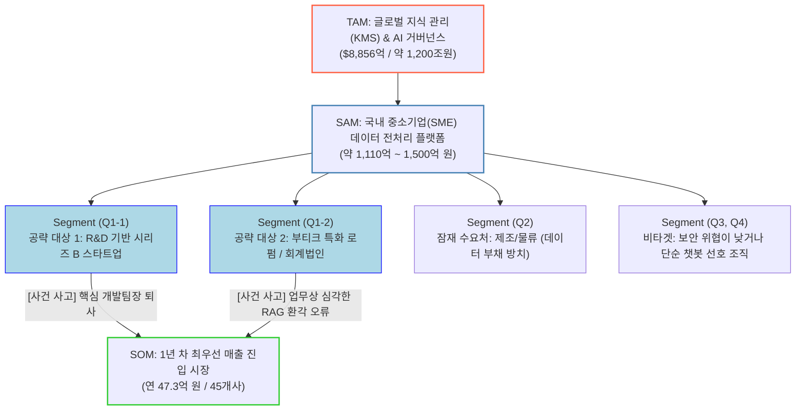
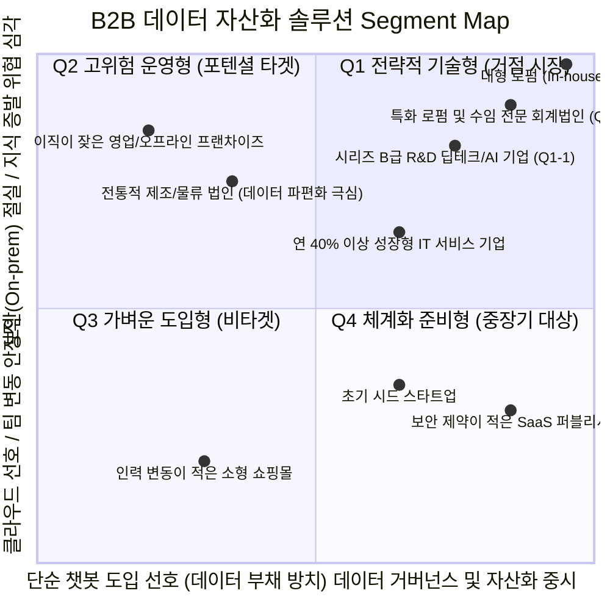
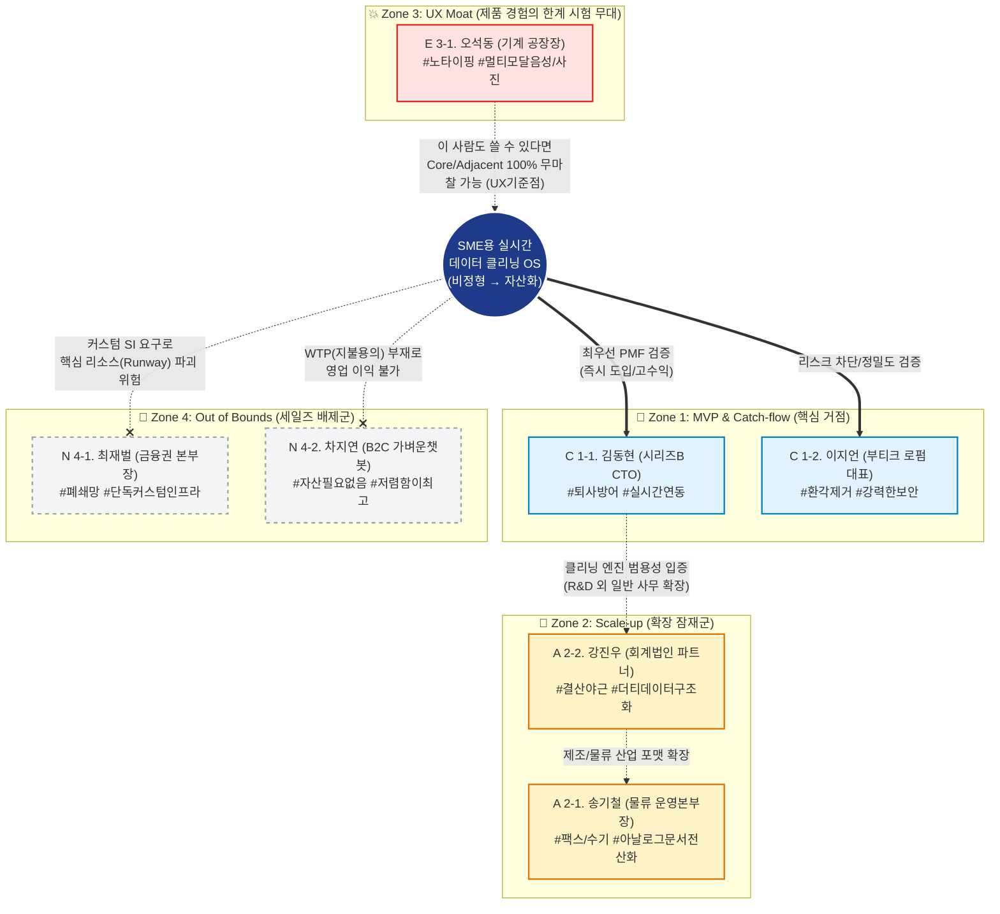
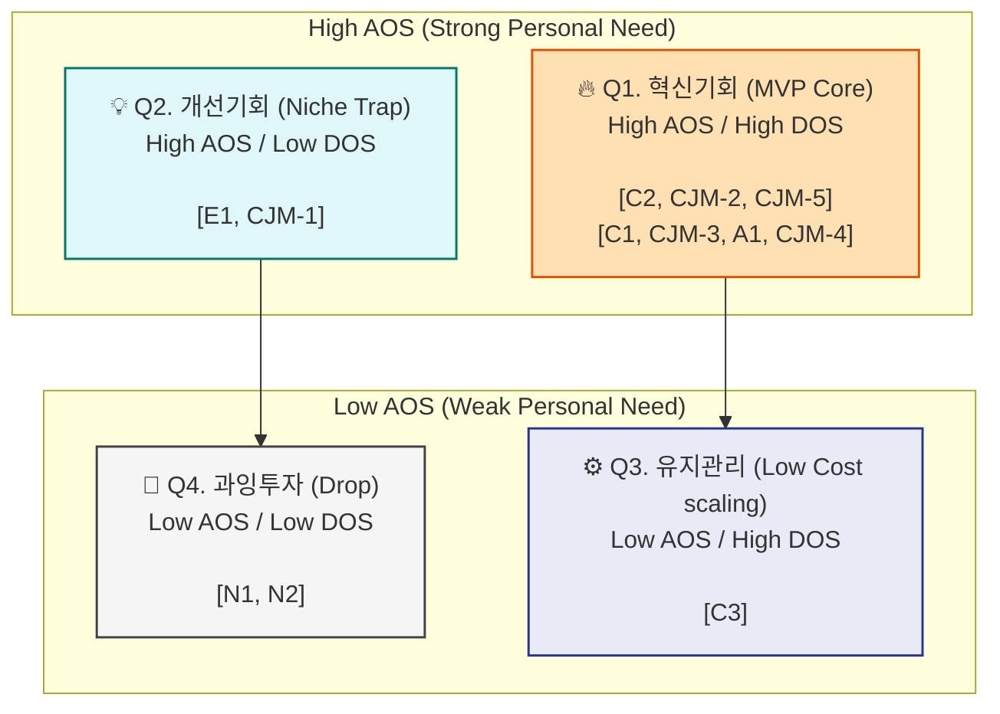
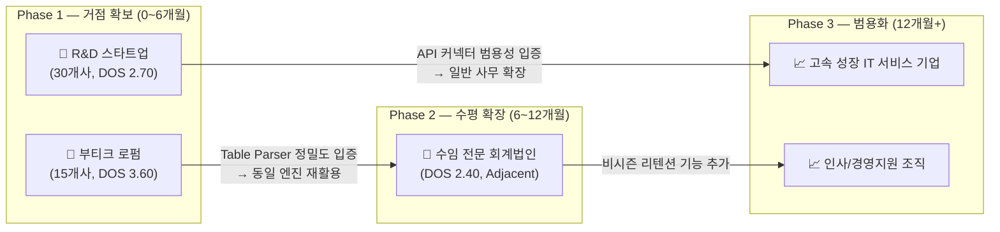
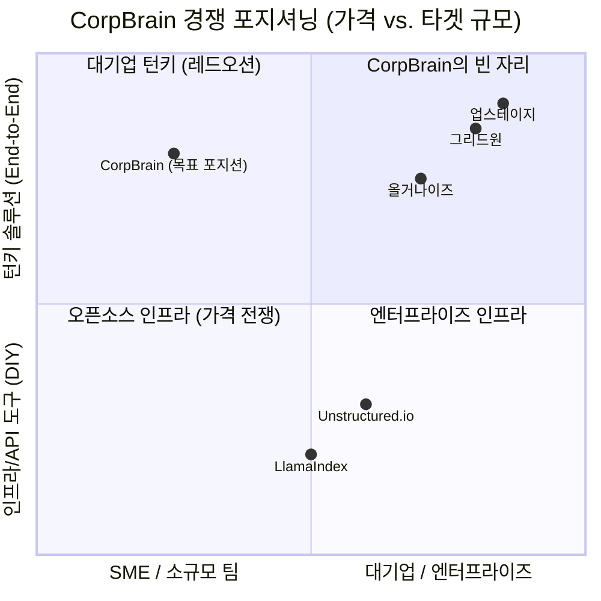

# Value Proposition Sheet V2 — CorpBrain (SME용 실시간 데이터 클리닝 OS)

> **문서 성격**: 본격 신규 사업을 처음 기획하는 예비창업자를 위한 **가치 제안 + 비즈니스 분석 통합 명세서**
> **분석 기반**: Porter's 5 Forces · 경쟁사 분석 · 가치사슬 · KSF · 문제정의서 · TAM-SAM-SOM · 페르소나 스펙트럼 맵 · 고객 여정 지도 · AOS-DOS 결합 평가 · JTBD 가상 심층 인터뷰
> **작성 방법론**: `8_ValueProposition_Sheet_작성방법.md` (페르소나·JTBD 기반 통합 문서 구성)
> **V2 특징**: 기존 Merged 문서가 단편적으로 언급하던 비즈니스 리서치 내용을 **원본 데이터(표·수치·다이어그램·인터뷰 스크립트)와 함께 직접 수록**하여, 이 한 장의 문서만으로 전체 사업 기획의 맥락이 완결되도록 구성

---

## 0. 사업 한 줄 정의

**CorpBrain은 문서와 파일이 파편화된 SME가 핵심 지식과 업무 데이터를 잃지 않도록, 무마찰 연동과 무결점 파싱, 검수 보조 UI를 통해 비정형 데이터를 신뢰 가능한 자산으로 바꿔주는 실시간 데이터 클리닝 OS이다.**

이 정의는 "고객이 누구인지 · 어떤 문제를 얼마나 심하게 겪는지 · 우리 솔루션이 무엇을 바꾸는지"를 한 문장에 담은 것입니다.

---

# Part I. 시장 구조 및 경쟁 환경 분석

## 1-1. 시장 개요 — Porter's 5 Forces 요약

> **전장 요약**: 이 시장은 환각(Hallucination) 없는 AI를 만들기 위해 기업의 산재한 파편화 문서를 추출·쪼개고(Chunking)·메타데이터화 하는 인프라형 시장입니다.
> **핵심 승부처**: 단순 텍스트 추출 기술(OCR)은 상향 평준화되고 있으므로, CorpBrain은 파싱 기술 그 자체가 아니라 **'어떤 문서가 오래된 쓰레기 문서인지 판별'하고 논리적 폴더 구조로 재구성하는 비즈니스 컨설팅 영역**까지 소프트웨어로 묶어내야만 글로벌 API와의 경쟁을 회피할 수 있습니다.

| Force (5세력) | 강도 | 핵심 리스크 원인 | CorpBrain의 방어 & 공격 전략 |
| :--- | :--- | :--- | :--- |
| **기존 경쟁자** | 매우 높음 🔴 | API 단가 하락, 기술 상향 평준화. 오픈소스 파싱 모델(LlamaParse 등) 대중화로 단순 텍스트 변환 단가는 2년 내 '무료'에 가깝게 폭락 전망 | 추출 한계(OCR)를 넘어선 '구버전/중복 솎아내기' 논리 모델링 특화. 기술 전쟁에 뛰어들지 않고 오픈소스를 Plug-in하되 클렌징 로직에 엔진 개발을 전량 집중 |
| **대체재** | 높음 🟠 | 빅테크 생태계(MS Copilot, Google Workspace AI) 자체 통합. 기존 클라우드 내부 파일에 대해 별도 전처리 없이 데이터 통합 | MS 생태계를 벗어난 로컬 파일, HWP, NAS 스토리지 집중 타겟팅. **빅테크가 읽어들이지 못하는 "사각지대의 레거시 자산 전처리"**로 포지셔닝 |
| **구매자** | 높음 🟠 | 전처리라는 '보이지 않는 후방 작업'에 돈 쓰기를 극도로 아까워하는 SME의 높은 가격 민감도 | 데이터 전처리를 별도 라이선스로 팔지 않고, **로컬 LLM 기반 초기 1회성 온보딩 비용**으로 포장. '문서 무상 체력 검진' 개념으로 영업 |
| **신규 진입자** | 낮음 🟢 | 온갖 더러운 기업 내부 문서 규격의 예외 처리(Exception Handling)를 위한 극도의 막노동(노하우) 필요 | 중소기업 특유의 지저분한 문서 패턴들을 템플릿화하여 진입 장벽(해자)을 굳힘. |
| **공급자** | 낮음 🟢 | OCR 엔진이나 Vision-LLM 선택지가 다수 존재 (네이버, 구글, 오픈소스) | 플러거블(Pluggable) 아키텍처로 특정 API 종속을 피하고 공급자 협상 우위 확보 |

---

## 1-2. 잠재 경쟁사 5개사 비즈니스 브리핑

비정형 데이터 전처리 시장의 주요 플레이어는 두 가지 진출 방식으로 양분됩니다:
- **글로벌 인프라형 플랫폼**: 대규모 문서 파싱 특화 API/오픈소스 (Unstructured.io, LlamaIndex)
- **버티컬 타겟형 솔루션**: 특정 산업군 문서 + 업무 자동화 엔드투엔드 (업스테이지, 올거나이즈, 그리드원)

| 기업명 | 비즈니스 규모 | 핵심 비즈니스 모델 | 사업 전략의 핵심 특징 |
| :--- | :--- | :--- | :--- |
| **Unstructured.io** | 시리즈 B (누적 ~$65M), 기업가치 ~2.3억 달러 | LLM용 비정형 데이터 전처리 및 Ingestion 파이프라인 (SaaS/API) | 오픈소스 선점 → 기업 VPC 배포 방식 및 과금형 SaaS로 락인 |
| **업스테이지 (Upstage)** | 1000억원 이상 투자유치 (시리즈B), 국내 금융/보험 탑 레퍼런스 | 최고 성능 자체 OCR(Document Parse) + LLM(Solar) 엔드투엔드 | 금융·보험 등 규제 산업군 버티컬 집중 타겟팅 |
| **그리드원 (GridOne)** | 20년+ RPA 업력, 2026 코스닥 상장 추진 | RPA + LLM + OCR 연동형 AI 에이전트 (GO;DO) | 고객 비즈니스 워크플로우 자동화 집중. 온프레미스 경량 sLLM 제공 |
| **올거나이즈 (Allganize)** | 시리즈B, 한·미·일 200개+ 엔터프라이즈 고객 | 기업 내 지식 RAG 'Alli' 올인원 챗봇 + 인지검색 플랫폼 | 복잡 표/차트 분석 + 페이지 단위 청킹으로 답변 정밀도 제고 |
| **LlamaIndex** | 세계적 규모 오픈소스 RAG 프레임워크 생태계 | Open-Core + 상용 LlamaCloud SaaS. LlamaParse 과금 체계 | 크레딧 기반 종량제 과금 + 인프라 규모별 Tier 과금 플랫폼 락인 |

> **시사점**: 5개 경쟁사 모두 **자금력이 튼튼한 대형 엔터프라이즈/금융/공공 기관**을 타겟으로 활약 중. CorpBrain의 SME 타겟은 높은 구축 비용과 IT 전문 인력 부재라는 한계가 있으므로, 고비용-고정밀 인프라 경쟁을 회피하고 **'파편화된 SME 문서의 로컬 단기 체력 검진'** 개념의 비즈니스 오퍼링이 필수적입니다.

---

## 1-3. 가치사슬 분석 — CorpBrain의 차별화 구조

### 통합 Value Chain

```
[Data Chaos]  →  [① Data Cleaning & Structuring]  →  [② Knowledge Graph + RAG]  →  [③ Decision Engine]  →  [④ Action Layer]  →  [Business Outcome]
```

### 기존 플레이어 대비 경쟁 포지셔닝

| 영역 | 기존 플레이어 | CorpBrain |
| :--- | :--- | :--- |
| Data | Unstructured → parsing만 | 구조 재설계 (semantic dedup + 폴더 자동 재구성) |
| Understanding | Upstage → 인식만 | 업무 맥락 이해 (context-aware retrieval) |
| Knowledge | Allganize → RAG 검색만 | 의사결정 엔진 (추천+판단+next action) |
| Execution | GridOne → RPA 중심 | API 기반 lightweight AI Agent 실행 |
| Orchestration | LlamaIndex → 개발자용 | **비개발자 SME용 올인원 통합 OS** |

> **핵심 공백**: 현재 시장에서 **"데이터 정리 → 이해 → 활용 → 실행"이 하나로 이어지는 구조가 없습니다.** 기존 기업은 각각 부분 최적에 머물고 있으며, CorpBrain은 전체 최적을 지향합니다.

### 핵심 차별화 포인트

- **① Inbound (핵심 차별화)**: 단순 ingestion이 아니라 **'데이터 컨설팅 자동화'** — 중복 문서 의미 기반 제거(semantic dedup), 폴더 구조 자동 재구성, 문서 중요도 scoring
- **기술 전략 (SME killer feature)**: Hybrid LLM 구조(Local → ingestion, Cloud → reasoning)로 **비용 + 보안을 동시에 해결**
- **데이터 전략**: 고객 데이터로부터 지속 학습 → organization knowledge graph 축적 → **시간이 지날수록 똑똑해지는 시스템**

---

## 1-4. 핵심 성공 요인 (KSF) Top 5

| # | KSF 명칭 | 선정 근거 |
| :---: | :--- | :--- |
| **1** | **프라이버시(폐쇄망) 환경의 레거시 자산 완벽 호환성 확보** | 대체재(MS Copilot 등 빅테크)와의 직접 경쟁을 피하고 생존하기 위한 결정적 조건. SME의 로컬 폐쇄망 및 C드라이브, HWP 등 구버전 문서 전처리를 완벽 지원하여 기술적 해자를 1차적으로 확보 |
| **2** | **의미 단위(Semantic) 기반 데이터 솎아내기 역량** | 단순 추출 단가가 무료에 가깝게 하락할 전망이므로, 무가치한 파편 문서를 판별해 내고 논리적 디렉토리로 구조화하는 비즈니스 컨설팅 수준의 엔진이 절대적 승리 조건 |
| **3** | **전처리 과금을 원천 차단하는 하이브리드 LLM 아키텍처** | 대규모 비정형 데이터를 클라우드 LLM에 올리면 API 비용 폭발. 가장 무거운 전처리는 로컬에서 비용·보안 유출 없이, 고난도 추리에만 클라우드 혼용하는 본질적 비용 우위 선점 |
| **4** | **1회성 '온보딩' 구축 비용화 영업** | 구매자의 높은 비용 민감도 극복. 정액형 구독 SaaS 대신 일회성 데이터 진단 리포트 형태로 포장하여 지불 의사의 심리적 장벽을 무너뜨리는 세일즈 기법 |
| **5** | **특정 기능 부서(법무/인사) 맞춤형 표준 폴더 템플릿 선점** | 후발 진입자 방어용. 법무 및 인사운영 부서를 겨냥한 직무별 표준 문서 트리 구조를 선점하여 교체 비용(Lock-in) 강화 |

---

## 1-5. 문제정의서 — 3가지 전략적 관점

### 관점 1: 인프라 구축 및 보안/비용 구조 (타겟: SME 경영진)
> **단독 IT 개발 인력과 막대한 예산이 부족한 중소기업 경영진**이 **내부 지식 관리를 위해 AI 시스템을 처음 도입하려 하는 상황**에서 겪는, **극비 문서 전체를 외부 클라우드에 업로드함으로써 발생하는 '보안 유출 리스크'와 막대한 API 토큰 '비용 부담'**을 해결하는 것이 가장 시급합니다.

### 관점 2: 법적 리스크 통제 및 지식 회수 (타겟: 법무/계약 실무 부서)
> **중소기업의 법무 검토 및 주요 계약 관리 실무자**가 **과거 체결된 합의서의 특정 조항 버전을 추적하거나 독소 조항 리스크를 점검하려는 상황**에서 겪는, **파편화된 구버전/중복 문서들로 인해 최신 원본을 확정하지 못하고 오판으로 인해 막대한 재무·법률 리스크에 노출되는 불편함**을 해결해야 합니다.

### 관점 3: 조직 운영 및 맥락 복구 (타겟: 인사/총무 팀장)
> **이직/퇴사율이 높아 전임자 의존도가 큰 중소기업의 인사/총무 팀장**이 **전임자 공백 이후 신입 직원이 파편화된 가이드로 업무 인수인계를 받아야 하는 상황**에서 겪는, **과거 문서의 작업 히스토리와 상하 맥락을 이해하지 못해 '조직의 기억'이 사실상 매번 소실되며 이를 사람이 일일이 뒤져야 하는 비효율적 시스템 부재**를 해결해야 합니다.

---

# Part II. 시장 규모 및 타겟 고객 정의

## 2-1. TAM-SAM-SOM 시장 구조



### 시장 규모 및 근거 요약

| 구분 | 시장 정의 | 시장 규모 | 핵심 논리 근거 |
| :--- | :--- | :--- | :--- |
| **TAM** | 전 세계 KMS 및 RAG 인프라를 위한 기업용 데이터 준비 SW 총 시장 | 연간 ~**$8,856억** (~1,200조원) | 글로벌 지식관리 시장 통계(2024년 기준) 및 AI 기반 전처리 필수재화 트렌드 |
| **SAM** | 한국 내 SME 대상 '비정형 데이터 전처리/클리닝 OS' 및 정부 바우처 매칭 시장 | 연간 ~**1,000억 ~ 1,500억 원** | 글로벌 비중 5% 추산, 2025년 정부 AI/혁신 바우처 총합 ~714억 원 기반 |
| **SOM** | 잦은 퇴사로 인한 지식 유실과 환각에 가장 예민한 타겟 기업 (스타트업 30곳 + 전문직 법인 15곳) | 달성 목표 연 **47.3억 원** | 핵심 세그먼트 포트폴리오 공략 |

---

## 2-2. Market Segment Map (2×2 Matrix)

데이터 자산화에 대한 열망이 강하면서도(X축 우측), 보안 제약 및 지식 유출 비용 리스크가 심각한 그룹(Y축 상단)이 위치한 **Q1(1사분면)**이 전략적 거점입니다.



**세그먼트 맵 시사점**:
- **Q1(우상단)**: 환각 제거율·망분리 등 고비용/고품질 가치에 가장 큰 지불 용의를 가진 핵심 그룹. '퇴사 시점'에 맞춘 타깃팅(PoC)이 효과적.
- **Q2(좌상단)**: 데이터 부채가 얼마나 심각한지 깨닫지 못한 상태. 향후 데이터 붕괴 사건 발생 시 Q1으로 이동하며 폭발적 가망 고객이 될 가능성.

---

## 2-3. 타깃 고객 요약 매트릭스

> 💡 **다온 코멘트**: 회비서님, 초창기 창업 리소스는 매우 한정되어 있습니다. 거창한 만능 비전보다는 '당장 고객이 지갑을 열게 만들 뾰족한 가치'에 집중해야 합니다.

| 구분 | 핵심 대상 | 왜 이 고객인가 |
| :--- | :--- | :--- |
| **Primary 1** | **부티크 특화 로펌 대표 / 파트너 변호사** | 표·특수양식 파싱 실패 → 법적 리스크. 보안 민감도와 WTP가 가장 높음. DOS 전체 1위 (3.60). |
| **Primary 2** | **시리즈 B R&D 스타트업 CTO** | 레거시 지식 단절·퇴사 블랙박스화·툴 분절이 직접 매출 손실에 연결. 도입 속도 빠름. DOS 2위 (2.70). |
| **Secondary** | **수임 전문 회계법인 파트너** | 시즌성 대량 문서 처리와 ERP 연동 수요가 강해 Core 검증 후 확장하기 좋은 세그먼트. DOS 6위 (2.40). |
| **Non-target** | **대형 금융권 / B2C / 단순 챗봇 수요** | 망분리 강박(DOS 0.00), 낮은 WTP(DOS 0.04), 범용 챗봇 대체 가능으로 초기 타겟에서 배제. |

---

## 2-4. 페르소나 스펙트럼 맵 — 제품 거리(Distance)와 관계(Relationship)

제품의 본질적 가치로부터 **얼마나 가깝고 절실한가(Core)**, **어떻게 확장될 수 있는가(Adjacent)**, **어디까지 UX를 타협하지 말아야 하는가(Extreme)**, 그리고 **절대 넘지 말아야 할 선(Non-user)**을 나타냅니다.



### 페르소나 상호작용 해석

1. **Core ↔ Extreme (진입 장벽 분쇄)**: 가장 WTP 높은 `김동현(CTO)`을 타겟으로 API 백엔드를 고도화하되, 인터페이스는 가장 진입 제약이 큰 `오석동(공장장)`을 기준으로 Zero-config 모드 개발 → 공장장님도 다루는 직관적 솔루션은 온보딩 개발자도 '학습 스트레스 0'으로 즉시 수용 → 압도적 Lock-in.
2. **Core ↔ Adjacent (기술 해자의 수평선 확장)**: 김동현(스타트업) R&D 문서화 고통과 강진우(회계) 영수증 파편화 고통은 기술적 본질(비정형 → 정형 파싱)이 동일 → Core 시장에서 클리닝 엔진 무결성을 증명하면 프롬프트/인지 모델만 교체하여 수평 전개 무한 가능.
3. **Core vs. Non-user (세일즈 효율 극대화)**: 김동현 세일즈 기간(2~4주) vs. 최재벌(금융권)은 최소 6개월 소진 후 드랍 → 영업 매뉴얼 최상단에 배치하여 '거대 레퍼런스' 현혹 방지.

---

# Part III. 고객이 겪는 핵심 문제 (Pain) 분석

## 3-1. 고객 여정 지도 (Customer Journey Map) — 핵심 페르소나

### 🎯 Core 1-1: 김동현 (시리즈 B 기술 스타트업 CTO)
**"핵심 인력 퇴사로 인한 레거시 데이터 블랙박스화 방어 여정"**

| 단계 | 고객 행동 | 고객 생각 | 감정 | Pain Point | 개선 기회 |
| :--- | :--- | :--- | :--- | :--- | :--- |
| **문제 인식** | 핵심 인력 퇴사 통보, 코드/히스토리 붕괴 인지 | "이 사람 나가면 기존 레거시 누가 파악하지?" | 불안, 막막함 | 흩어진 Slack/Git의 데이터 파편화 | "핵심 인력 퇴사 징후" 진단 콘텐츠 노출 |
| **탐색** | 노션 정리 지시 및 자동 파싱 솔루션 검색 | "수작업은 시간 낭비, 바로 연동하는 OS 없나?" | 조급함 | 툴별 분절 시스템 + 구축형 SI의 긴 리드타임 | Slack/Github API 원클릭 연동 하이라이트 |
| **의사결정** | 아키텍처/연동성/보안 검토 | "하루 만에 도입할 수 있을까?" | 의심 | 클라우드 유출 우려 및 신뢰 부족 | On-prem/VPC 기반 암호화 + 1일 셋업 데모 |
| **사용** | API 연동 실행, 첫 클리닝 처리 완료 | "연동은 쉬웠는데 에러 로그는?" | 답답함 | Human-in-the-loop UI 직관성 부족 | 에러 트래킹 대시보드 + 원클릭 복구 튜토리얼 |
| **유지** | 신규 입사자 2주 내 온보딩 성공 | "인수인계 단절 없이 스프린트 살렸다" | 안도, 성취감 | 전사 확장 시 비용 증가 우려 | 조직 단위 업셀링 패키지 제안 |

### 🎯 Core 1-2: 이지언 (부티크 로펌 대표)
**"RAG 챗봇 환각 리스크 해소 및 완벽한 법률 정제 여정"**

| 단계 | 고객 행동 | 고객 생각 | 감정 | Pain Point | 개선 기회 |
| :--- | :--- | :--- | :--- | :--- | :--- |
| **문제 인식** | 챗봇이 없는 판례를 생성, 재판 리스크 감지 | "잘못된 판례로 소송 지면 누가 책임져?" | 분노, 공포 | RAG 엔진의 심각한 환각 | '더티 데이터'가 환각 원인임을 입증하는 백서 제공 |
| **탐색** | 표를 100% 안 깨뜨리는 전처리 툴 검색 | "표와 조항을 완벽히 분리해 줄 곳 없나?" | 기대, 피로 | 법률 특수 양식(표, 도장)을 이해 못 하는 범용 OCR | 법률 특화 전처리 엔진(오류율 8% 미만) 비교 툴 |
| **의사결정** | 보안 실무자 대동하여 망분리 준수 확인 | "비용이 얼마라도 좋으니 틀리지만 않게 해달라" | 강박 | 민감 정보(주민번호 등) 유출 리스크 | PII 자동 마스킹 시연 + 무료 PoC |
| **사용** | 10년 치 서류 업로드 및 메타데이터 추출 | "정확도는 미쳤는데 초기 세팅이 좀 무겁네" | 압도됨 | 로펌별 맞춤 스키마 설정의 어려움 | 전담 Success Manager + 스키마 템플릿 무료 셋업 |
| **유지** | 환각 0% 사내 지식 검색 엔진 리오픈 | "이제야 AI가 쓸모 있네. 다른 수임건도 다 넣어" | 강한 신뢰 | 스토리지 비용 압박 | 자동화 스케줄러 + 데이터 압축 기술 |

### 🔄 Adjacent 2-2: 강진우 (수임 전문 회계법인 파트너)
**"결산 시즌 야근 철폐, 비정형 영수증 → 규격 DB 변환 여정"**

| 단계 | 고객 행동 | 고객 생각 | 감정 | Pain Point | 개선 기회 |
| :--- | :--- | :--- | :--- | :--- | :--- |
| **문제 인식** | 종소세 시즌 수기 장부 폭주 | "주니어들 밤새워 엑셀 타이핑하다 도망가겠네" | 압박감 | 구조화 안 된 더티 데이터 존재 자체의 고통 | "영수증 1만 장 자동화" 타겟 광고 |
| **탐색** | 영수증 전용 OCR/RPA 비교 | "기존 OCR은 표가 다 깨져서 결국 눈으로 또 봐야 해" | 분노 | Free-form 파싱 기술의 부재 | 금액/날짜 100% 매핑 전처리 데모 |
| **의사결정** | 기존 회계 프로그램 연동 여부 고민 | "텍스트 잘 뽑아서 뭐해, ERP에 안 들어가면 말짱 꽝" | 의심 | 출력 결과물 호환성 미확신 | 회계 표준 포맷(XML, CSV) + 메이저 ERP 연동 데모 |
| **사용** | 1만 장 영수증 업로드 후 엑셀 확인 | "추출 속도는 엄청난데 흐릿한 글자 오류는?" | 당황 | Confidence score UX 미흡 | AI 확신도 80% 미만 붉은색 하이라이트 UI |
| **유지** | 결산 마감 작년 대비 절반 시간 종료 | "이게 전처리 혁명이지" | 환희 | 비시즌 사용량 급감 방어 | 타 비정형 서류 클리닝 기능 리텐션 캠페인 |

---

## 3-2. Pain 요약 매트릭스

| 고객군 | Pain | 현 상태의 문제 |
| :--- | :--- | :--- |
| 로펌 | 표와 특수 양식이 깨지면 의사결정 자체가 위험해짐 | 주니어가 수작업으로 4시간 이상 검수·재입력하며, 실수 한 번이 치명적 |
| CTO | 퇴사·온보딩 때 문서와 지식이 파편화되어 블랙박스화 | Slack, GitHub, Notion이 분절되어 최신 문서를 가려내기 어렵고, 잘못된 버전이 사고를 유발 |
| 회계법인 | 영수증·장부·증빙의 양식이 너무 다양함 | 시즌마다 반복 작업이 폭증하고, 기존 OCR/RPA만으로는 실무 검수 불가 |

---

# Part IV. AOS-DOS 결합 시장 진입 평가

**"고객만 아프고 시장은 작은(돈이 안 되는)" 맹점(Trap)을 걸러내고, 가장 빠르고 확실한 MVP 스펙을 확정합니다.**

- **Market Relevance (MR, 0.1~1.0)**: 해당 Pain이 TAM-SAM-SOM에서 갖는 비중, 채택 속도, 영업 접근성
- **Demand Opportunity Score (DOS)**: `AOS × MR` — 개인의 강렬한 고통을 '실제 시장에서 돈이 될 규모와 속도'로 치환

## 4-1. DOS 전체 항목 계산표

| # | Pain / Goal | Imp | Sat | MR | MR 근거 | DOS |
| :---: | :--- | :---: | :---: | :---: | :--- | :---: |
| **C2** | 법률/특수 표 양식 파싱 실패 (리걸리스크) | 5 | 1 | **0.9** | 법률·회계 전문직(SOM)의 절대적 요구, 즉각적 WTP 최상 | **3.60** |
| **CJM-2** | 텍스트 외 물리적 서식 깨짐 | 5 | 1 | **0.9** | 모든 B2B 도입의 첫 허들. 산업 초월적 공통 병목 | **3.60** |
| **CJM-5** | AI 오류 색출 보조 UX 부재 | 5 | 1 | **0.8** | 엔터프라이즈 전환율 극대화 UX 차별점 | **3.20** |
| **C1** | R&D 레거시 데이터 파편화 및 연동 단절 | 5 | 2 | **0.9** | 최우선 SOM(시리즈B Tech) 생태계 지배 사안 | **2.70** |
| **CJM-3** | 클라우드 사용에 따른 보안 공포 | 5 | 2 | **0.9** | 전 산업 B2B SW 채택의 가장 강력한 법적·심리적 허들 | **2.70** |
| **A1** | 수많은 영수증 포맷 양식 붕괴 및 야근 | 5 | 2 | **0.8** | 시즌 시장 + 일반 기업 재무팀으로 스케일업 용이 | **2.40** |
| **CJM-4** | 마이그레이션 노가다 | 4 | 2 | **0.8** | 온보딩 포기의 70% 구간. 해결 시 채택 난이도 급락 | **1.92** |
| **CJM-1** | 데이터 자산 누수의 사후 체감 | 4 | 2 | **0.6** | 마케팅용 훅(Hook) 역할에 그침 | **1.44** |
| **E1** | 구형 시스템 키보드/IT 조작 불가 장벽 | 4 | 1 | **0.3** | 제조업 파이 거대하나 디지털 채택 속도 최악 | **0.96** |
| **C3** | 사내 규정 핑퐁 및 위키 통제 부재 | 4 | 3 | **0.5** | '대충 때우며 버티기' 가능해 예산 배정 안 됨 | **0.80** |
| **N2** | B2C 긴 텍스트 요약 | 2 | 4 | **0.1** | B2C 범용 / 챗GPT가 100% 시장 장악 | **0.04** |
| **N1** | 망분리 상황 자체 인프라 강박 | 5 | 4 | **0.0** | 영업 자체가 구조적으로 차단된 안티 타겟. MR 0 수렴 | **0.00** |

## 4-2. AOS-DOS 결합 매트릭스



### 핵심 발견

1. **"함정(Trap)의 발견" — 오석동 공장장(E1)의 몰락**: AOS 3.2(고통 극심) → DOS 0.96(돈 안 됨) 추락. 제조업 결정권자의 신기술 채택 속도와 전파력(MR)이 워낙 둔감하여, 투자 대비 매출(DOS) 회수 불가. **Pain은 숭고하나 MVP 타겟에서 제외해야 함을 수치로 증명.**
2. **"돈의 흐름 증명" — CTO(C1)와 마이그레이션(CJM-4)**: AOS 2.4~3.0이나 시장 확산성(MR)이 최상위. **AOS 점수가 살짝 낮아도 즉각적 매출 전환력(DOS)이 Q1에 확고히 랭크.**

---

# Part V. JTBD 가상 심층 인터뷰 결과

## 5-1. Persona 1: 이지언 (부티크 특화 로펌 대표)

> **검증 가설**: "리스크 제로를 향한 구조화" — 판례·핵심 합의서 기반 중대 의사결정 시 표/특수양식 파손 없이 100%에 가까운 인식률을 요구하며 보안에 매우 민감한 고부가가치 전문직 세그먼트 (DOS 3.60, 전체 1위)

### 인터뷰 스크립트 (요약)

**[Part 1] Job의 상황적 맥락과 기존 대안(Firing) 파악**
- **Q. 최근 AI/검색기 도입을 검토하다 실망하신 적이 있나요?**
  - *"대형 리걸테크 M사 솔루션을 비롯해 몇 가지 OCR 소프트웨어를 테스트해 봤습니다. 문제는 우리 로펌이 다루는 건설 하도급 계약서의 복잡한 도표나 특수 약관 양식을 범용 AI가 죄다 텍스트 한 줄로 뭉뚱그려 박살 내버린다는 겁니다."*
- **Q. 가장 치명적인 타격이나 경험이 무엇입니까?**
  - *"한 번은 자산 실사 보고서의 재무제표 표 안에서 숫자의 단 단위가 밀려, 완전히 잘못된 금액으로 실사 의견이 나갈 뻔했습니다. 그 사건 이후 자동화 툴은 절대 믿지 말자고 파트너들끼리 결의했죠."*
- **Q. 현재 그 문제를 어떻게 '땜질' 하고 계십니까?**
  - *"주니어 변호사 3명이 매일 4시간씩 원본과 대조하며 수기로 구조화하고 엑셀에 옮겨 적습니다. 그들의 비싼 인건비를 단순 복사-붙여넣기에 태우고 있는 겁니다."*

**[Part 2] 4 Forces 집중 발굴**
- **Push**: *"주니어들이 수작업에 매몰되다 보니 정작 고부가가치 딜에 투입될 리소스가 부족해져 수주 기회를 여러 번 놓쳤습니다."*
- **Pull**: *"100% 로컬 환경에서 구동되어 데이터 유출 우려가 없고, 표 양식을 완벽히 파싱한다면요? 매일 아침 단순 대조 작업 대신, 핵심 쟁점으로 바로 전략 회의를 시작하는 그림이 그려집니다."*
- **Habit**: *"막상 도입하면 'AI가 한 것도 의심스럽다'는 본능적 불안감이 클 겁니다. 결국 서류를 처음부터 다시 뽑아 대조할 가능성이 농후합니다."*
- **Anxiety**: *"도입 결정을 주저하게 하는 건 단연 '보안'입니다. 망분리 솔루션이라 해도 로컬 내 다른 프로그램과 충돌하거나 정보가 새면 로펌 문을 닫아야 합니다."*

**[Part 3] UI/UX 피드백 (MVP 검증)**
- **Q. AI 판단 신뢰도(Confidence Score)가 낮은 부분만 붉은색으로 하이라이트 해주는 UI가 있다면?**
  - *"(눈을 반짝이며) 그게 핵심이네요! 인간 변호사는 붉은색 표시만 집중 검수하면 되니까, 심리적 방어선이 구축됨과 동시에 검수 시간이 압도적으로 줄어듭니다. 그 기능이 제대로 엑셀에 뽑혀 나온다면 즉시 유료 도입합니다."*

### JTBD 요약 카드

| 구분 | 내용 |
| :--- | :--- |
| **Persona / Segment** | **코어 (DOS 1위)** – 부티크 특화 로펌 대표 및 파트너 변호사 |
| **Situation** | 복잡한 도표가 포함된 계약서나 판례를 기반으로 **긴급하고 중대한 법률적 의사결정을 내려야 할 때** |
| **Job Statement** | **단 1%의 정밀도 손실(표/구조 붕괴)도 없이 특수 양식을 완벽한 정형 데이터로 빠르게 구조화하고자 함** |
| **Desired Outcome** | 치명적 환각/에러율 0건 제어, 변호사의 수작업 문서 검수 시간 단축 (4h → 30m 이내) |
| **4 Forces** | **Push:** 수작업 매몰로 수주 기회 박탈 / **Pull:** 로컬+도표 완벽 파싱 / **Habit:** 전수 검사 강박 / **Anxiety:** 정보 유출 공포 |
| **Current Solutions** | 범용 OCR + 주니어 변호사의 수동 엑셀 기입 워크어라운드 |
| **Switch Trigger** | 잘못된 인식으로 인한 대형 소송 오판 위기 경험 |
| **Priority** | **AOS = 4.0, DOS = 3.60** (Importance=5, Satisfaction=1) |

### Outcome 목록

| Outcome | Imp | Sat | AOS | MR | DOS | 증거 (인용) |
| :--- | :---: | :---: | :---: | :---: | :---: | :--- |
| 데이터 수동 검수·구조화 시간 단축 | 5 | 1 | 4.0 | 0.9 | 3.60 | "주니어 비싼 인건비 낭비" |
| 표/특수 양식 환각율 0% 보장 | 5 | 2 | 3.0 | 0.8 | 2.40 | "숫자 밀리면 의견서 전체가 휴지통" |
| 망분리 위반 없이 사내망 처리율 100% | 4 | 2 | 2.0 | 0.8 | 1.60 | "보안 무너지면 로펌 파산" |

---

## 5-2. Persona 2: 김동현 (시리즈 B R&D 기술 스타트업 CTO)

> **검증 가설**: "마찰 없는 파편화 방어 및 지식 회수" — 성장과 인력 회전이 빠르며, 방치된 구버전/파편화 데이터 관리에 대한 강한 니즈. 가장 빠른 확산 속도 기대 (DOS 2.70, 전체 2위)

### 인터뷰 스크립트 (요약)

**[Part 1] Job의 상황적 맥락과 기존 대안(Firing) 파악**
- **Q. 사내 지식 관리나 검색기 도입에 실망하신 적이 있나요?**
  - *"RAG 열풍이라 랭체인으로 사내 위키를 구성해 봤습니다. 최악이었습니다. '쓰레기를 넣으면 쓰레기가 나온다'는 걸 뼈저리게 느꼈죠. 중복 파일, 구버전 API 문서가 다 섞여서 환각이 엄청납니다."*
- **Q. 조직 내 가장 치명적이었던 사건은?**
  - *"새로 입사한 개발자가 검색기에서 찾아준 옛날 API 명세를 보고 코딩했다가 프로덕션에 버그를 터뜨렸습니다. 롤백하고 클라이언트한테 사과하느라 며칠 밤을 샜어요."*
- **Q. 지금 시스템 지식 전달 방식은?**
  - *"팀장들이 본인 슬랙/노션에 저장해 둔 링크를 일일이 긁어모아 신규 입사자에게 전달합니다. 노가다도 이런 노가다가 없고, 팀장 휴가 가면 업무가 멈춥니다."*

**[Part 2] 4 Forces 집중 발굴**
- **Push**: *"작년에 핵심 개발자 2명이 동시에 나갔을 때 시스템 레거시 히스토리가 완전히 블랙박스. 한 달 치 스프린트가 그대로 날아갔어요."*
- **Pull**: *"쓰레기 파일을 골라내고 최신 버전만 의미있게 템플릿화해서 하나의 통합 파이프라인으로 연결해 준다면, 퇴사자 핸드오버와 온보딩이 며칠에서 단 몇 시간으로 줄어들 겁니다."*
- **Habit**: *"이쪽 바닥 사람들은 본인만의 툴(Github 채널, 분리된 슬랙 등)에 고립되길 좋아합니다. 중앙 통제식 플랫폼으로 이사가라고 하면 엄청난 불만과 저항에 부딪힙니다."*
- **Anxiety**: *"기존 슬랙이나 노션의 권한 체계를 깨뜨리지 않을지 걱정입니다. 또한 API 콜 남발로 감당 못할 API 트래픽 과금이 날아올까 봐 무섭습니다."*

**[Part 3] UI/UX 피드백 (MVP 검증)**
- **Q. 기존 툴 뒤편에서 API로만 증분(차이점)만 긁어모아 One-Click 연결해 주는 백그라운드 연동 방식이라면?**
  - *"불필요한 과금 없이 딱 필요한 업데이트 내용만 긁어와 준다면 최고의 솔루션이네요. 개발자들이 툴을 바꿀 필요도 없다면 당장 팀 계정으로 결제하겠습니다."*

### JTBD 요약 카드

| 구분 | 내용 |
| :--- | :--- |
| **Persona / Segment** | **코어 2 (DOS 2위)** – 폭발적으로 성장 중인 시리즈 B 기술 스타트업 CTO |
| **Situation** | 인력 교체기/급격한 온보딩 시점에 **파편화된 암묵적 지식이 블랙박스화될 위기에 직면했을 때** |
| **Job Statement** | **임직원에게 새로운 툴 학습 마찰을 주지 않으면서도 흩어진 정보를 통합해 신뢰할 수 있는 사내 RAG/위키를 구축하고자 함** |
| **Desired Outcome** | 구버전/쓰레기 문서 필터링 자동화율 극대화, 온보딩/마이그레이션 시간 Days → Hours |
| **4 Forces** | **Push:** 쓰레기 RAG 사고 / **Pull:** 구버전 필터링+최신 큐레이션 / **Habit:** 사일로 도구 선호 / **Anxiety:** 권한 충돌+과금 폭탄 |
| **Current Solutions** | 팀장의 수작업 링크 큐레이션 + 파편화된 다중 툴 방치 |
| **Switch Trigger** | 레거시 지식 단절로 스프린트 통째로 지연되는 금전적 피해 경험 |
| **Priority** | **AOS = 3.0, DOS = 2.70** (Importance=4.5, Satisfaction=1.5) |

### Outcome 목록

| Outcome | Imp | Sat | AOS | MR | DOS | 증거 (인용) |
| :--- | :---: | :---: | :---: | :---: | :---: | :--- |
| 쓰레기 파일(구버전 등) 필터링 정확도 | 4.5 | 1.5 | 3.0 | 0.9 | 2.70 | "쓰레기 넣으면 쓰레기 나온다" |
| 신규입사자 인수인계 지식 체계화 시간 감소 | 4.0 | 2.0 | 2.0 | 0.8 | 1.60 | "스프린트 한 달 치 날림" |
| 복수 툴 연동 시 마찰 비용 0화 | 4.0 | 2.5 | 1.5 | 0.7 | 1.05 | "중앙화 시키려 하면 저항 심함" |

---

## 5-3. 전략적 시사점 (JTBD → 제품/GTM 연계)

1. **기능 개발 — 신뢰감 회복 UI/UX 우선**: 두 페르소나 모두 기존 AI에 대한 **"속은 경험(환각 등)"**이라는 짙은 트라우마 보유. 초기 MVP 핵심은 '빠른 추출 속도'보다 **'에러 Confidence 표기(로펌향)' 및 '구버전/쓰레기 필터링 로직(스타트업향)' 등 투명한 검증 기능** 확보에 집중해야 함.
2. **세일즈 소구점**: 로펌 대표 → **"100% 로컬 망분리로 데이터 유출 원천 차단"** / CTO → **"기존 툴 변경 없는 백그라운드 통합 + 과금 캡(Cap) 보장"**을 캐치프레이즈 화.

---

# Part VI. 핵심 가치 제안 시트 — 타겟별 상세 (Problem–Solution Fit)

> 각 고객은 서로 다른 상황에서 서로 다른 고통을 겪고 있으므로, **고객별로 뾰족하게 다듬어진 가치 제안**이 필요합니다.

### 📌 Segment A: 부티크 특화 로펌 대표 — 이지언
*DOS 1위 (3.60) · SOM 15개사 · 연 매출 기여 목표 18.7억 원*

| 항목 | 내용 |
| :--- | :--- |
| **Pain 요약** | **[Pain 1] 환각이 곧 소송 패배** — 범용 AI/OCR이 복잡한 도표 양식을 텍스트 한 줄로 파괴. 재무제표 단 단위 밀림으로 잘못된 실사 의견 사고. *"숫자 한 번 밀리면 실사 보고서 하나로 로펌 문 닫습니다."*<br><br>**[Pain 2] 주니어 변호사의 값비싼 시간이 복사-붙여넣기에 소진** — 3명이 매일 4시간 수기 검수 → 고부가가치 딜 리소스 부족 → 수주 기회 복수 회 상실<br><br>**[Pain 3] 망분리가 깨지면 파산** — 민감 정보 유출 시 로펌 존립 위협. 클라우드에 대한 원초적 불신 |
| **Job Statement** | *"복잡한 도표가 포함된 계약서나 판례를 기반으로 긴급하고 중대한 법률적 의사결정을 내려야 할 때, 단 1%의 정밀도 손실도 없이 특수 양식을 완벽한 정형 데이터로 빠르게 구조화하고자 함"* |
| **Outcome** | ① 수작업 검수 시간: **일 4h → 30min 이내** (87.5%↓)<br>② 표/특수 양식 환각·오표기: **0건 통제**<br>③ 사내망 위반율: **0%** (100% 로컬) |
| **Value Proposition** | **"단 하나의 셀도 깨뜨리지 않는 무결점 구조화 엔진 + AI가 의심스러운 데이터를 붉게 표시하는 Confidence 하이라이터 + 망분리 완전 호환"** |
| **기존 대안과 한계** | **직접 경쟁**: 업스테이지(금융·보험 대기업 타겟, SME 예산 초과) / 올거나이즈(RAG 중심, 파싱 정밀도 비핵심)<br>**간접 대체재**: 주니어 3명 × 일 4시간 수작업 (인건비 연 ~7,200만원)<br>**시장 공백**: 5개 경쟁사 모두 대기업·금융 집중. **SME 전문직(연 1,000~3,000만원) 전용 솔루션 부재** |
| **차별적 가치** | ① **정밀도 해자**: 표 내부 셀 경계·병합·주석을 원본 그대로 복원하는 전용 파싱 로직. "CorpBrain ≠ ChatGPT"의 분기점<br>② **심리적 안전망 UX**: AI 확신도 80% 미만 → 붉은색 하이라이트. 전수 검사 강박 해소<br>③ **가격 접근성**: 대기업향(연 수억) 대비 1/10 비용 구간에서 동등 이상 정밀도 |
| **Proof** | **정량**: AOS=4.0, DOS=3.60, Imp=5/Sat=1 (최대 미충족 갭)<br>**정성**: *"붉은색 표시만 집중 검수하면 되니까 즉시 유료 도입합니다"* — 이지언 대표 |

---

### 📌 Segment B: 시리즈 B 기술 스타트업 CTO — 김동현
*DOS 2위 (2.70) · SOM 30개사 · 연 매출 기여 목표 28.6억 원*

| 항목 | 내용 |
| :--- | :--- |
| **Pain 요약** | **[Pain 1] 퇴사 시 레거시 블랙박스화** — 핵심 개발자 2명 동시 퇴사 → 시스템 히스토리 전체 유실 → 한 달 치 스프린트 증발<br><br>**[Pain 2] RAG → '쓰레기 투입 → 쓰레기 산출'** — 중복·구버전 API 문서 섞여 프로덕션 버그 → 며칠 롤백<br><br>**[Pain 3] 중앙 통제 시스템 강요 시 개발자 반발** — 사일로 툴(Slack/Github/Notion) 고립 선호 문화 |
| **Job Statement** | *"인력 교체기·급격한 온보딩 시점에 파편화된 암묵적 지식이 블랙박스화될 위기에 직면했을 때, 임직원에게 새로운 툴 학습 마찰 없이 흩어진 정보를 통합해 신뢰할 수 있는 사내 RAG/위키를 구축하고자 함"* |
| **Outcome** | ① 구버전·쓰레기 필터링: **자동화율 극대화**<br>② 온보딩·인수인계 시간: **주 단위 → 시간 단위** (85%↓)<br>③ 기존 툴 연동 마찰 비용: **제로** |
| **Value Proposition** | **"개발자가 쓰던 툴을 단 하나도 바꾸지 않고, 백그라운드에서 구버전·중복 문서를 자동 솎아내어 '살아있는 지식'만 남기는 무마찰(Zero-Friction) 데이터 클렌징 엔진"** |
| **기존 대안과 한계** | **직접 경쟁**: Unstructured.io(클렌징 로직 미제공) / LlamaIndex('무엇을 버릴지' 판단은 고객 몫)<br>**간접 대체재**: 팀장의 수작업 링크 큐레이션 + 다중 툴 방치<br>**시장 공백**: 글로벌 인프라 도구들은 '수집·파싱'에 집중하되 **'구버전/중복 문서의 의미 기반 클렌징 레이어'는 방치** |
| **차별적 가치** | ① **Zero-Friction 설계 원칙**: Slack·Github·Notion 뒤편에서 API 증분(incremental) 수집<br>② **클렌징 중심 사고**: '더 많이 모으는' RAG가 아니라 '쓰레기를 골라내는' OS<br>③ **예측 가능한 비용**: 증분 동기화로 불필요한 API 트래픽 최소화 → CTO 과금 불안 해소 |
| **Proof** | **정량**: AOS=3.0, DOS=2.70, MR=0.9 (SOM 내 R&D 스타트업 30개사로 최대 세그먼트)<br>**정성**: *"개발자들이 툴을 바꿀 필요도 없다면 당장 팀 계정으로 결제하겠습니다"* — 김동현 CTO |

---

### 📌 Segment C (확장 타겟): 수임 전문 회계법인 파트너 — 강진우
*DOS 6위 (2.40) · Adjacent Zone · Core 검증 후 수평 확장 대상*

| 항목 | 내용 |
| :--- | :--- |
| **핵심 문제** | 종합소득세 시즌마다 제각각인 수기 장부·영수증 폭주. 기존 OCR은 표가 다 깨짐 → 재검수 필수. 주니어 회계사가 밤새 엑셀 타이핑하다 이직 → 시즌마다 반복 |
| **JTBD 목표** | **"양식이 제각각인 증빙을 빠르게 구조화해, 결산·신고 마감 시간을 줄이고 싶다"** |
| **Outcome** | ① 결산 마감: 작년 대비 **50% 단축** / ② Free-form 영수증 금액/날짜 **100% 매핑** / ③ 회계 표준 포맷(XML, CSV) 및 메이저 ERP 호환 |
| **Value Proposition** | Core(로펌)에서 검증된 **무결점 Table Parser 엔진을 영수증/증빙 양식으로 확장 적용** + 회계 표준 포맷 내보내기 지원 |
| **왜 "확장 타겟"인가** | 로펌과 기술 본질(특수 양식 정밀 파싱)이 동일 → 프롬프트/스키마만 교체하면 수평 전개 가능. 단, 시즌성이 있어 비시즌 리텐션 전략 필요 |

---

# Part VII. 기존 대안 종합 비교 및 차별적 가치

## 7-1. 기존 대안 종합 비교 (Competitor / Substitute)

| 대안 | 한계 |
| :--- | :--- |
| 범용 OCR / 문서 파서 | 표·차트·특수 서식을 깨뜨리기 쉽고, 전문직 실무에서 바로 쓰기 어렵습니다. |
| 수동 엑셀 정리 | 정확성은 높일 수 있지만, 비용과 시간이 너무 큽니다. (로펌 기준 인건비 연 ~7,200만 원 이상) |
| 글로벌 전처리 플랫폼 (Unstructured.io, LlamaIndex) | 인프라·개발자 친화적이지만, SME 레거시 파일 정리와 도입 마찰 해소에는 직접적이지 않습니다. |
| 버티컬 엔터프라이즈 솔루션 (Upstage, Allganize, GridOne) | 대기업·규제 산업 중심. SME 초기 진입에는 비용과 구조가 너무 무겁습니다. |

## 7-2. 차별적 가치 요약

| 차별점 | 의미 |
| :--- | :--- |
| **기존 툴을 바꾸지 않음 (Zero-Friction)** | 사용자의 학습 저항을 줄이고 도입 속도를 높입니다. |
| **최신/유효 데이터만 선별 (클렌징 중심)** | CTO 세그먼트의 "쓰레기 문서" 문제를 직접 해결합니다. |
| **Confidence Score 기반 검수 UX** | 전문직이 불안해하는 환각/오류를 시각적으로 통제합니다. |
| **SME 맞춤 가격·시장 포지션** | 대형 엔터프라이즈 경쟁을 피하고, 실제 도입 가능한 비용 구간(연 1,000~3,000만 원)의 빈 시장. |

---

# Part VIII. 통합 VP 선언문 — 한 문장 요약

> 투자자 미팅, 랜딩 페이지 헤드라인, 세일즈 덱 표지에 직접 활용 가능합니다.

**CorpBrain은, 핵심 인력 퇴사와 AI 환각이라는 두 가지 생존 위협에 직면한 중소 전문직 법인과 기술 스타트업을 위해, 기존 업무 환경을 전혀 바꾸지 않으면서도 파편화된 비정형 데이터를 무결점으로 구조화하고 쓰레기 데이터를 자동으로 솎아내는, SME 전용 실시간 데이터 클리닝 OS입니다.**

**→ 이 사업의 본질은 "문서를 잘 읽는 기술"이 아니라, "고객이 믿고 바로 업무에 쓸 수 있는 자산으로 바꾸는 능력"입니다.**

---

# Part IX. Job→MVP Feature Map (기능 우선순위 정리)

상기 VP를 기술적으로 실현하기 위한 MVP 백로그 우선순위. **DOS(시장 파괴력) × 기술 의존성**을 결합하여 확정.

| 우선순위 | MVP Feature | 해결 대상 (Pain ID) | DOS | 대상 세그먼트 | 선후 의존성 | 기대 효과 및 구현 맥락 |
| :---: | :--- | :--- | :---: | :--- | :--- | :--- |
| **P1** | **무결점 Table & Form Parser** | C2, CJM-2, A1 | **3.60** | 로펌 → 회계(확장) | 없음 (최선행) | 원본 문서의 틀과 셀 매트릭스를 100% 보존. GPT와 차별화 짓는 기술적 해자 |
| **P2** | **Confidence Score 에러 하이라이터 UI** | CJM-5 | **3.20** | 로펌 (결제 트리거) | P1 의존 | 신뢰도 낮은 구역만 컬러링 → AI 맹신 공포 제거 → 결제 유도 무기 |
| **P3** | **One-Click API 백그라운드 커넥터** | C1, CJM-4 | **2.70** | 스타트업 CTO | P1 활용 | 기존 워크스페이스 증분 추적 최신화. '행동 변화' 마찰 완전 제거 |
| **P4** | **PII 오토 마스킹 & 하이브리드 배포** | CJM-3 | **2.70** | 공통 컴플라이언스 | P1 후처리 | 민감 정보 자동 블라인드. B2B 기초 Compliance 장벽 돌파 |
| **Drop** | Zero-config 카메라/음성 모듈 | E1 | **0.96** | 오석동 (제조업) | — | DOS 최하. 고통은 극심하나 채택 속도(MR 0.3) 최악. 런웨이 보호 위해 보류 |

**핵심 의존성 구조**:
```
[P1: Table Parser] ──────────────────────┐
       │                                 │
       ▼                                 ▼
[P2: Confidence UI] ← 신뢰도 점수 의존    [멀티포맷 어댑터 (회계 확장)]
       │
       ▼
[P4: PII 마스킹] ← 파싱 결과물 후처리
       │
       ▼
[P3: API Connector] ← 마스킹된 데이터의 안전한 연동
```

→ **P1(파서)이 모든 후속 기능의 기반입니다. P1의 품질 확보가 전체 사업의 성패를 결정하는 단일 병목(Single Point of Failure)입니다.**

---

# Part X. 부록 — GTM, 경쟁 포지셔닝, 세일즈 실무

## 부록 A. 세그먼트 간 확장 경로 (Go-To-Market Sequence)

본 사업의 시장 진입은 '동심원 확장(Concentric Expansion)' 전략입니다.



**확장 논리**: 
- **로펌 → 회계법인**: '특수 양식(표) 정밀 파싱' 기술 본질이 동일. 프롬프트/스키마만 교체하면 수평 전개 가능.
- **스타트업 → IT 서비스 기업**: 'API 기반 다중 툴 연동' 요구가 동일. 커넥터 목록 확장만으로 시장 확대.
- 이 경로를 역행(제조업부터 시작)하면 DOS 0.96의 늪에 빠져 런웨이가 소진됩니다.

---

## 부록 B. 절대 하지 말아야 할 3가지 (Anti-Pattern Checklist)

| # | 함정 (Anti-Pattern) | 근거 (데이터 출처) | 방어 행동 |
| :---: | :--- | :--- | :--- |
| 1 | **"대기업 레퍼런스"에 현혹되어 SI 수주 수락** | Non-user 4-1 최재벌: 미팅 6개월 소진 후 드랍, DOS=0.00. CJM에서 "네들 로직 뜯어보고 참고용으로나 써야지"라는 오만함까지 포착 | 영업 매뉴얼 최상단에 금융권·대기업 블랙리스트 등록. "당사는 SI 외주 불가" 원칙 명문화 |
| 2 | **"감동적인 Pain" 기반으로 MVP 스펙 비대화** | Extreme 3-1 오석동: AOS 3.2(고통 극심)이나 DOS 0.96(돈 안 됨). MR=0.3. CJM에서 "나 죽으면 이 공장 문 닫아야 해"라는 절박함 확인하나 채택 속도 최악 | "고통이 크다 ≠ 시장이 있다"를 팀 전원이 체화. AOS만으로 백로그에 올리지 말 것 |
| 3 | **WTP 없는 B2C 유저에게 무료 트라이얼 제공** | Non-user 4-2 차지연: "챗GPT 월 2만 원이면 다 해결. 도입비 수백만 원짜리 OS를 뭐하러 사", DOS=0.04 | B2C 이메일 도메인(gmail 등) 가입 차단 또는 저가형 Self-serve 전용 트랙으로 격리 |

---

## 부록 C. 경쟁사 대비 포지셔닝 맵



**포지셔닝 해석**:
- **Q1(좌상단, SME × 턴키)은 현재 비어 있습니다.** 기존 경쟁사들은 모두 대기업 × 인프라 또는 대기업 × 턴키에 밀집.
- CorpBrain은 이 공백을 점거하되, '턴키'의 의미를 **'원클릭 셋업 + 즉시 결과 확인'**으로 재정의.
- 이 포지션은 경쟁사의 기존 BM(고비용 SI/API 과금)과 정면 충돌하지 않으므로 한정된 자원으로도 방어 가능.

---

## 부록 D. 솔루션 핵심 가치 1장 요약 (세일즈 덱·IR 활용)

| 구분 | 부티크 로펌 대표에게 말할 때 | 기술 스타트업 CTO에게 말할 때 |
| :--- | :--- | :--- |
| **공포 자극 (Push)** | "지금 수작업 대조에 주니어 연봉의 절반을 태우고 계십니다." | "다음 핵심 인력이 나가면, 지난번처럼 한 달이 아니라 분기가 날아갑니다." |
| **비전 제시 (Pull)** | "매일 아침 대조 작업 대신, 붉은색 표시만 확인하고 바로 전략 회의를 시작하세요." | "개발자 한 명도 툴을 바꾸지 않았는데, 신규 입사자가 첫날부터 코드를 칩니다." |
| **불안 해소 (Anxiety)** | "100% 로컬 망분리. 데이터는 사무실 밖을 한 발짝도 나가지 않습니다." | "증분 동기화로 API 과금 캡이 보장됩니다. 예상 밖 청구서는 없습니다." |
| **전환 요청 (CTA)** | "이번 주 금요일, 귀사의 실제 계약서 10건으로 무료 PoC를 진행하시겠습니까?" | "Slack 워크스페이스 하나만 연결해 보시겠습니까? 5분이면 됩니다." |

---

## 부록 E. 예비창업자를 위한 전략적 보강 항목

### E-1. 사업 운영 가설

| 항목 | 권장 내용 |
| :--- | :--- |
| **사업 포지셔닝** | "문서를 읽는 AI"가 아니라 **"업무 가능한 데이터로 바꾸는 OS"**로 정의. 경쟁사와의 차별점이 선명해짐 |
| **초기 고객 확보 방식** | 로펌과 시리즈 B CTO를 양쪽에서 동시에 노리되, 실제 첫 매출은 **환각 리스크가 치명적인 전문직**에서 만드는 편이 빠름 |
| **수익모델 가설** | 초기: 도입비 + 구독형 + 문서량 기반 과금 혼합. 후기: 연동 수와 보안 옵션으로 확장 |
| **검증 지표 (KPI)** | 정확도, 수작업 절감 시간, 온보딩 시간, 검수 전환율, 도입 후 재사용률 |
| **제외 전략** | 금융권 대형망, B2C 챗봇, 과도한 SI 커스텀 요구는 초기에 버려야 런웨이 보전 |

### E-2. 다온의 전략 어드바이스

> 회비서님, 본 문서는 '분석의 종착점'이 아니라 **'실행의 출발점'**입니다.

1. **코드보다 콜드콜이 먼저입니다.** 본 VP Sheet의 '1장 요약(부록 D)'을 들고 실제 부티크 로펌 대표 또는 시리즈 B CTO에게 콜드콜 미팅을 잡으십시오. 그들이 고개를 끄덕이는 순간이 진짜 PMF 신호입니다. 고개를 젓는다면 이 문서를 버리고 다시 인터뷰해야 합니다.

2. **P1(Table Parser)의 품질이 사업 전체의 단일 병목입니다.** 모든 후속 기능(Confidence UI, API 커넥터, PII 마스킹)은 P1 위에 쌓입니다. P1이 기존 OCR 대비 눈에 띄는 차이를 보여주지 못하면 나머지는 무의미합니다. 첫 3개월은 P1에만 올인하십시오.

3. **'가짜 스케일업'인 커스텀(SI) 함정을 냉정하게 거절하십시오.** 은행 특화 거대 인프라 수요자(최재벌 페르소나)가 찾아와 수십억 원짜리 시스템 구축을 요구할지라도 응해서는 안 됩니다. 한정된 초기 리소스를 특정 1개사를 위한 하청 용역에 태우는 순간 '플랫폼 스타트업'은 사망합니다.

4. **결제 용의가 뾰족한 로펌/회계 타겟의 성과를 레버리지 하십시오.** 규모는 작아 보여도 돈을 낼 의지와 동기가 가장 확고한 'Q1 스윗스팟'입니다. 이들의 혹독한 오차 기준을 넘긴 파서를 확보하면, 이후 스타트업 CTO를 거쳐 전 범위로 확장 가능합니다.

5. **개발팀을 자리에 앉히기 전에 랜딩 화면부터 들고나가십시오.** 본 문서로 가정이 성립되었습니다. 즉시 '가짜 UI 화면이 들어간 랜딩페이지'나 '미팅용 세일즈 덱'을 작성하고, 실제 타겟 고객에게 콜드콜 미팅(Pre-totyping)을 꽂아 구매 전환율을 확인하는 것이 코딩보다 시급한 제1순위 과제입니다.

6. **"예비창업자 = 만능인"이라는 착각을 경계하십시오.** P1(파서 엔진)은 기술 공동 창업자의 영역이고, PoC 세일즈는 회비서님의 영역입니다. 역할 분리가 안 되면 두 가지 모두 중간 품질에 머물게 됩니다.

---

## 최종 요약

초기에는 **로펌의 특수 양식 파싱**과 **CTO의 레거시 지식 정리**를 양대 축으로 잡고, 그 다음 **회계법인**으로 확장하는 구도가 가장 자연스럽습니다. 이 선택은 시장 규모, 진입 난이도, 지불 의사, 경쟁 지형을 모두 함께 고려한 결과이며, AOS-DOS 결합 분석에 의해 정량적으로도 뒷받침된 결론입니다.
