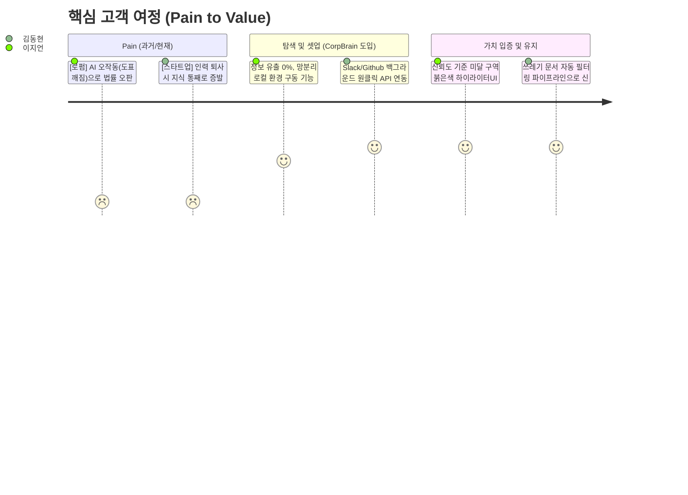

# CorpBrain (SME용 실시간 데이터 클리닝 OS) PRD v0.1
- Owner 팀: 다온 & 회비서
- 최종 업데이트: 2026-04-11

## 1. 개요·목표

- **문제 정의(Pain지표 포함)**:
  - **[Pain 1 - 부티크 로펌]** 복잡한 법률 서식(도표)의 파싱 붕괴 및 환각 발생.
    - *실패 KPI*: "문서 파싱 후 수작업 검수 및 대조 시간 일 4시간 초과 건수 비중 80% 이상", "데이터 추출/표기 오류율 5% 초과".
  - **[Pain 2 - 기술 스타트업]** 핵심 인력 퇴사로 인한 레거시 데이터 블랙박스화 및 분절된 환경.
    - *실패 KPI*: "신규 입사자 시스템 지식 인수인계 및 온보딩 소요 시간 2주 이상 비율 70%", "기존 사일로 앱 데이터 중복으로 인한 RAG 환각 사고 발생률 15% 초과".

- **목표(Desired Outcome 수치화)**:
  - 사용자의 수작업 문서 검수 시간 극단적 단축 (**일 4h → 30min 이내**, 87.5% ↓).
  - 표/특수 양식 환각 및 문서 오표기 **0건(0%)** 달성.
  - 신규 인력 온보딩 및 문서 최신화 세팅 소요 시간 **Days 단위에서 Hours 단위로 감축** (85% ↓).
  - 클라우드 유출 리스크 없는 **사내망/망분리 완전 준수(위반율 0%)**.

- **성공 지표(북극성/보조 KPI)**:
  - **북극성 KPI**: 무결점 포맷 보존 파싱 성공률 (Baseline: 85% → Target: 99.9%, 주간 측정).
  - **보조 KPI 1**: 고객당 평균 수작업 대조 체류 시간 (Baseline: 4시간/일 → Target: 30분 미만/일, 월간 측정).
  - **보조 KPI 2**: 쓰레기/구버전 문서 자동 필터링률 (Baseline: 0% → Target: 90% 이상 차단, 주간 측정).
  - **보조 KPI 3**: 도입 후 첫 파트너 툴(Slack/Github) 동기화 구동 시까지의 온보딩 소요 시간 (Target: 1시간 이내, 건별 즉시 측정).

---

## 2. 사용자와 페르소나

- **핵심 페르소나 요약**:
  1. **이지언 (부티크 특화 로펌 대표 / 코어 1)**
     - Pain & Needs: 범용 문서 파서의 한계로 도표가 깨지면서 실사 보고서 작성 시 패소 등 법률적 위기 초래. 100% 로컬 보안 환경 내에서 표/특수 양식을 정밀 파싱하고, 인간에게 오류 가능 구역을 알려주는 기능이 시급함.
  2. **김동현 (시리즈 B 기술 스타트업 CTO / 코어 2)**
     - Pain & Needs: 핵심 기술 인력 퇴사 이후 Slack/Github 등에 파편화된 지식이 유실되어 조직 스프린트가 망가짐. 기존 툴 구조를 그대로 두면서 구버전을 솎아내고 살아있는 최신 지식만 파이프라인으로 연결하길 원함.



---

## 3. 사용자 스토리와 수용 기준(AC, Acceptance Criteria)

### **Story 1: 법률적 리스크를 통제해야 하는 전문직 집단**
> **Story**: As a 부티크 로펌 파트너(이지언), I want 도표/특수양식을 100% 복원하여 파싱하고 불안해하는 저신뢰도 구간을 하이라이트 표시해주길 원한다, so that 내가 에러 색출 및 수기 대조에 쏟는 일일 업무 시간을 4시간에서 30분 이내로 줄일 수 있다.

- **AC 1 (무결점 표 추출):** Given 로펌 특화 양식(표, 문서 주석 포함)이 업로드되었을 때, When 로컬 클리닝 엔진이 파싱을 완료하면, Then 표 셀 병합과 경계선의 **99.9%가 어긋남 없이 정형 데이터 포맷(CSV/XML/Markdown)으로 추출**되어야 한다.
- **AC 2 (Confidence 하이라이터):** Given 추출된 결과물을 변호사가 검수 플랫폼에서 열람했을 때, When AI 파싱 확신도(Confidence Score) 판별 기준이 **80% 미만인 데이터가 감지되면**, Then 해당 영역을 자동으로 즉시 **붉은색으로 하이라이트 표시**하여 인간의 시선 구조를 보조해야 한다.
- **AC 3 (망분리 사수):** Given 고객사가 완전 폐쇄망(Local On-premise) 설치를 요구할 때, When 문서 파싱 및 렌더링을 완전히 마쳤을 때, Then 외부 클라우드로 전송되는 **아웃바운드 통신(트래픽) 볼륨이 정확히 0 Byte**여야 한다.

### **Story 2: 파편화 지식을 방어해야 하는 기술 조직**
> **Story**: As a 기술 스타트업 CTO(김동현), I want 기존 Slack/Github를 그대로 연동한 채로 백그라운드 엔진이 쓰레기 문서를 걸러주길 원한다, so that 개발자들의 툴 전환 마찰 없이도 퇴사자 지식 블랙박스를 걷어내 신입사원을 단기간에 온보딩시킬 수 있다.

- **AC 1 (무마찰 연동 속도):** Given 사용자가 사용 중인 기존 도구(Slack, Notion 등) 환경에서, When CorpBrain 커넥터 연동 버튼을 클릭하면, Then **5분 이내에 증분 동기화 셋업이 백그라운드 가동**되며 사용자의 UI 워크플로우를 전혀 변경하지 받아들여져야 한다.
- **AC 2 (쓰레기 필터링 효율):** Given 파편화된 과거 명세서 더미가 수집 엔진에 들어올 때, When Semantic Dedup(의미 기반 중복 제거)을 거치면, Then **구버전 및 의미 없는 안내성 텍스트 문건의 90% 이상이 자동 블록/배제**되고 최신 자산만 남아야 한다.
- **AC 3 (API 과금 캡 제어):** Given 실시간 API 동기화가 동작 중일 때, When 새로운 변경점(증분 코스트)을 읽어 들일 때, Then 사용자 설정 월 API 토큰 상한액(Cost Cap)을 초과하는 콜이 발생할 경우 **즉시 100% 호출을 중단하고 경고 알림**을 띄워야 한다.

---

## 4. 기능 요구사항(Functional)

| MSCW 우선순위 | 기능명 | 기능 요약 | 근거 (대안 대비 차별 가치 - Differential Value) |
| :--- | :--- | :--- | :--- |
| **Must Have** | **무결점 Table & Form Parser**<br>*(최우선 개발)* | 표의 셀 구조 및 병합 셀을 기존 OCR보다 파괴 없이 보존하여 JSON화 | - 기존 대안 범용 OCR 대비 **표 파싱 에러율 90% 이상(1/10 수준) 차단**.<br>- 외부 툴 사용 시보다 주니어 인건비 기반 비용 **연간 80% 이상 절감**. |
| **Must Have** | **Confidence Score 에러 하이라이터 UI** | 의심 데이터(80점 미만)를 붉은색 시각 기호로 통제하는 검수 UI 제공 | - 인간의 맹목적 전수 대조 시간(대안) 대비 **검수 시간 87.5% 가속**.<br>- "AI 맹신 극복"이라는 최고 등급의 심리적 안정성. |
| **Should Have** | **단일 클릭 백그라운드 커넥터** | API키만 넣으면 Slack/Github 뒤에서 조용히 증분 업데이트 실행 | - 직접 스크립트 연결 시 소요 시간 7일(대안) 대비 **단 5분(99% 감소) 이내 세팅**.<br>- 툴 전환율 저항 0%. |
| **Should Have** | **가비지 선별(Semantic Dedup)** | 중복 문서, 구버전 API 명세, 인사말 등을 지식 추출에서 강제 제외 | - 기존 RAG 솔루션은 다 때려 넣고 랭킹만 분석하지만, CorpBrain은 사전에 필터링 처리하여 **클라우드 API 처리 및 스토리지 비용 최소 60% 이상 절약**. |
| **Could Have** | **PII 오토 마스킹 컴플라이언스** | 주민등록번호/기밀 데이터 자동 탐지 후 마스킹 처리 후 내보내기 | - B2B 세일즈 돌파를 위한 컴플라이언스 킬러 기능. |
| **Won't Have** | **범용 음성/이미지 획득 모듈** | 공장장, 제조업 등 타이핑 불가 직무를 위한 음성/OCR 사진 로직 배제 | - 현재 SOM(기술·특화 로펌) 공략 구간에서 ROI가 무너짐(과잉 투자 방어). |

---

## 5. 비기능 요구사항(NFR, Non-Functional Requirement)

- **성능**: 
  - p95 응답 기준: 문서 장당 파싱 완료 소요 시간 **≤ 1,500 ms**
  - 배치 파싱 시 증분 데이터(Delta) 수집 동기화 지연 **≤ 3 minutes**
- **신뢰성**: 
  - 클리닝 파서 시스템 월간 가용성 **≥ 99.9%** 유지
  - 추출 과정(Parser Error Rate) 중 엔진 크래시 및 오류율 **≤ 0.1%** 통제
- **보안/비용**:
  - 고객사가 지정한 PII(민감 정보)는 클라우드 LLM으로 쏘기 **전, 무조건 로컬 망에서 마스킹/암호화(Hybrid 배포 아키텍처 의무 사용)** 탑재.
  - 고객별 월 토큰 제한값 설정 기능 제공, 해당 토큰 초과 컷오프(Cut-off) 구현 탑재.
- **모니터링 항목**:
  - [로그] 실패 로그 빈도수 및 OOM(Out-Of-Memory) Memory Limit 초과 트래킹.
  - [대시보드] 고객 사용 대시보드 내 "Confidence Score 80점 미만 파일 밀집 구역 리스트" 노출.
  - [알림] API 트래픽 변화량 임계치 돌파 시 Slack 자동 알림 경고 기준 할당.

---

## 6. 데이터·인터페이스 개요

### 핵심 엔터티 (Entities)
```mermaid
erDiagram
  WORKSPACE ||--o{ SOURCE_INTEGRATION : contains
  WORKSPACE ||--o{ PARSED_DOCUMENT : manages
  PARSED_DOCUMENT ||--o{ DATA_NODE (Chunk) : split_into

  WORKSPACE {
    string id PK
    string client_id
    boolean is_on_premise
    float cost_cap
  }
  SOURCE_INTEGRATION {
    string source_type "Slack, Github, Local"
    string auth_token
    string last_sync_time
  }
  PARSED_DOCUMENT {
    string id PK
    string original_file_name
    string file_type
    boolean validation_passed
  }
  DATA_NODE (Chunk) {
    string id PK
    string node_type "Table, Text, Form"
    string semantic_content
    float confidence_score
    boolean is_obsolete "쓰레기/중복 여부"
  }
```

### 외부/내부 API 개요 (입출력·제약)
- **외부 Connector API (Ingestion)**:
  - 연동 방식: 웹훅(Webhook) 우선 채택, Polling 시 증분(Incremental) ID 기반 제한적 호출.
  - 제약: 타사 OAuth 토큰 순환 리프레시 보안 유지, API Rate Limit 최적 우회.
- **내부 Engine API (Parsing & Cleaning)**: 
  - `POST /api/v1/clean` 
    - Input: 업로드 파일 바이너리 (최대 50MB 제한) + 스키마 템플릿 메타.
    - Output: 구조화된 JSON 데이터 배열 + {`highlight_ranges`, `confidence_metrics`}.
- **Export API (Outbound)**: 
  - 지원 포맷: 통합 JSON, CSV, 표준 XML 덤프, 혹은 기존 사용 중인 범용 RAG Vector DB용 구조화 Payload 전송.

---

## 7. 범위(In/Out), 리스크·가정·의존성

- **In / Out 명시**
  - **IN Scope**: SME용 로컬 폐쇄망 파서 엔진 구현, 구버전 필터 판단 로직(Semantic Dedup), 저신뢰도 하이라이터 UI 제공, Slack/Github 커넥터 제공.
  - **OUT of Scope**: 비정형 문서를 새로 자동 기안/생성하는 에이전트, 화려하고 복잡한 프론트엔드 자체 채팅뷰어(RAG 봇 자체 제작보다 후방 데이터 클리닝 배관에 집중), 단독 SI 수주 기반 맞춤 개발 제공.

- **핵심 리스크 및 완화 플랜 (최소 3개)**
  1. *[경쟁리스크]* 오픈소스 파서 API 단가 하방 압력 평준화.
     - **대응 방안**: 단순 인식/변환 외에 "비즈니스 컨설팅 수준의 폴더 자동 재구성 및 의미 단위 솎아내기 역량(Dedup)" 기능 고도화에 개발 집중.
  2. *[기술리스크]* 특수 양식 템플릿이 특정 로펌별로 예외 케이스(Edge case)가 터질 우려.
     - **대응 방안**: 탑 티어 로펌이 쓰는 표준 계약서 템플릿 10여 가지를 사전 학습시켜 Rule-based + LLM의 Hybrid 패턴으로 정확도를 영구 방어.
  3. *[비즈니스]* 인프라 설치 요구로 인한 On-premise 영업 마찰 및 세팅 시간 오버헤드.
     - **대응 방안**: 인프라 종속성을 끊는 완전한 컨테이너(Docker/K8s) 형태로 플러그앤플레이(Plug & Play) 제공 (ADR-001 인프라 정책 참조 요망).

- **가정·의존성**
  - 고객사 내 별도의 숙련된 파이썬/플랫폼 엔지니어가 개입하지 않아도 시스템 UI로 초기 세팅이 종결된다고 가정함.
  - [ADR-002: LlamaParse 등 강력한 오픈소스 생태계 종속 피하기 플러거블 패턴 채택 링크 연계를 상정]

---

## 8. 실험·롤아웃·측정

- **베타 채널 (PoC 가동 타겟)**: 
  - 거점(SOM) 시장인 "부티크 로펌 3개 파트너스" 및 "시리즈 B급 R&D 스타트업 5개사" 대상 밀착 Closed Beta 운영 (2~4주).

- **실험 가설 및 측정 계획**:
  1. **[로펌] AI 확신도 UI 전환 효율 극대화 가설** 
     - 가설: "Confidence 80 미만 붉은색 하이라이터 UI를 부여하면, 인간 변호사의 검수 전환 완료율 스트레스가 소멸하고, 검수 소요 시간이 경쟁 툴 대비 3배 이상 빠를 것이다."
     - 측정 지표(Metrics): 평균 문서당 UI 검수 승인완료까지 클릭 시간 추적 (로그), 만족도 평가 5점 척도.
     - 성공 기준: 처리 시간 80% 감소 + 만족도 평균 4.5 초과.
  2. **[스타트업] 쓰레기 분리 RAG 파이프라인 신뢰 방어 가설**
     - 가설: "사내 Slack 원클릭 커넥터 동기화 후, Semantic Dedup으로 문서를 걸러냈을 때 기존 통합 RAG보다 환각 팩트체크 실패율이 유의미하게 감소할 것이다."
     - 측정 지표(Metrics): A/B 모델 테스트 (기존 툴 RAG vs CorpBrain 클리닝 엔진 후속 RAG의 정답률). 
     - 성공 기준: 구버전 레퍼런스를 잘못 참조하는 횟수가 5% 미만 유지.

- **경쟁 대안 대비 벤치마크 (vs Upstage & Unstructured.io)**:
  - 분기별 동일한 오염된 실측 데이터 세트(Dirty dataset 1,000건)를 기준으로 `표(Table) 파싱 F1-Score 부문 오차율` 비교 시험 가동.
  - 목표치: 무거운 엔터프라이즈 타사 대비 과금 비용 -50% 절약 달성 및 특수 표 정밀 파싱 오차율 25% 포인트 상단 점유 달성.

---

## 9. 근거 (Proof)

본 제품 요구사항 명세는 창업자의 감이 아닌 아래의 구조화된 비즈니스 근거 문서를 기초로 설계되었습니다.

1. **[가치제안 분석 문서 & 5 Forces (AOS/DOS)]**
   - 분석 증명 코어 링크: ["15_merged-V2-ValueProPositionSheet.md" 참고](file:///c:/Users/docto/OneDrive/문서/modu2026-02/02_VPS-Drafts/15_merged-V2-ValueProPositionSheet.md)
   - 근거: 부티크 로펌의 파싱 붕괴 고통 (DOS 3.60 전체 1위), 스타트업 연동성 고통 (DOS 2.70 전체 2위)
2. **[상세 페르소나 JTBD 고객 심층 인터뷰 스크립트]**
   - 심층 증명 인터뷰 덤프 링크: ["16_V2-Final-ValueProPositionSheet.md" 참고](file:///c:/Users/docto/OneDrive/문서/modu2026-02/02_VPS-Drafts/16_V2-Final-ValueProPositionSheet.md)
   - 발언 인용 1: *"붉은색 표시만 리뷰하면 심리적 방어선 구축되어 즉시 도입함" (이지언 변호사 인터뷰 파트 3)*
   - 발언 인용 2: *"과거 중복 기록을 필터링해주고 개발자 마찰을 0으로 만드는 백그라운드 연동이면 당장 전사 결제할 것" (김동현 CTO 인터뷰 파트 3)*
